## css第一天总结
## css介绍

**1.HTML** **的局限性**

- HTML ：负责组织 网页的**结构和内容**
- 局限性：页面不够 **"****美丽"**

**2.CSS** **网页的美容师**

- CSS：层叠样式表，简称 **样式表**
- 作用：负责给网页做 **美容**

HTML 和 CSS 关系：

**内容、结构**  和 **页面美化**

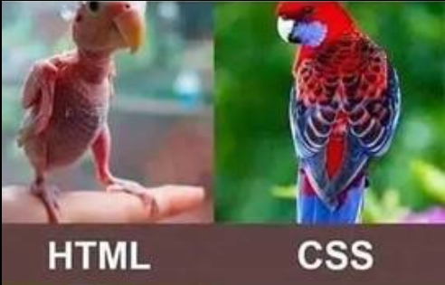

## css语法规则:

### 书写位置

三种书写位置

- 行内：写在目标标签 中

- **内嵌：写在** **<style></style>** **标签中**(学习过程中使用最多)

- 外部：写在 .css 文件，再通过 <link> 标签引入到 html 页面中

语法：

- **内嵌样式表** 写在 一对 style 标签中，style 标签 一般写在 head 标签中

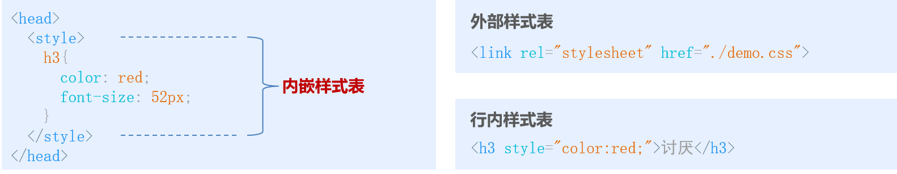

### 基本语法规范

```css
 CSS语法由 两部分 组成

   选择器：就是用来选择 要使用样式表的标签 的语法

   样式表：各种样式的声明（如：字体颜色，大小等）
```


1. 样式表

语法：

- 属性名和属性值 以 **键值对** 形式表示

- 属性**名值**间 用 英文冒号 ":" 隔开

- 属性**键值对** 用 英文分号 ":" 隔开 

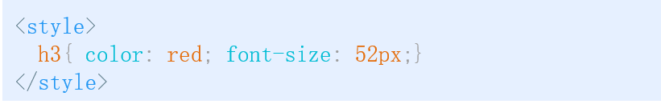

### 代码风格:

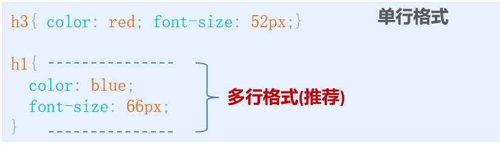

注意：

- 全部英文都是用小写（特殊情况除外）

## css选择器:

### 基础选择器:

选择器的作用：**选择标签**

#### 标签选择器

概念：是指用 HTML标签名 作为选择器，为页面中某一种标签设定 CSS样式

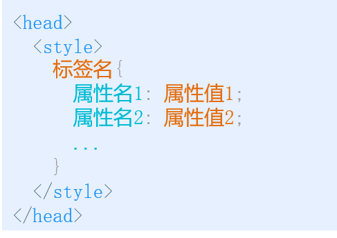

**缺点：只能针对某一种标签设置样式，无法差异化**

#### 类选择器

**类选择器(class选择器)**

- 通过 class属性值 来查找标签
- 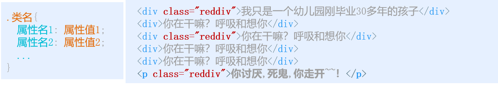

#### id选择器

- 通过 id属性值 来查找标签
- 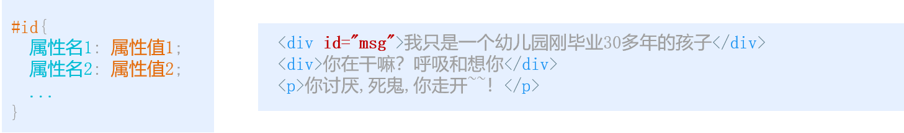

id与class的区别

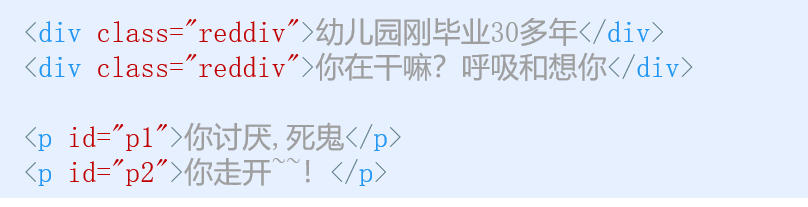

- **class(类名)** 类似 人的名字，有重名的情况

- **id** 类似 人的身份证号，国内唯一，不会重复
- 使用：**类选择器** 开发时用的最多

#### 通配符选择器

查找页面中所有标签

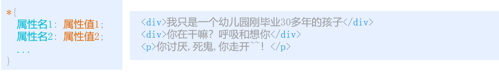

基础选择器总结

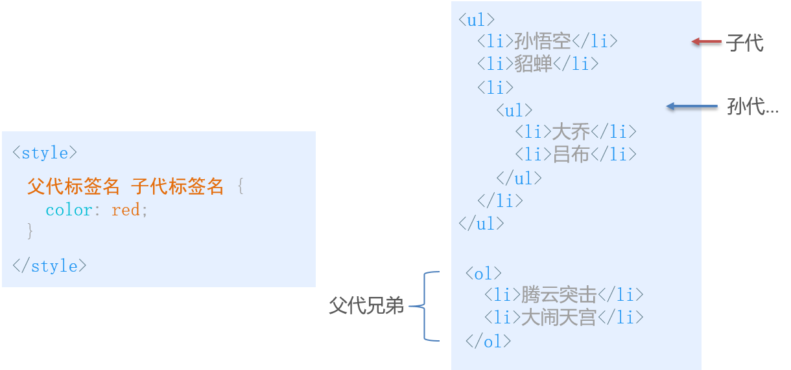

每个基础选择器都有适用的场景，其中 类选择器 用的相对最多

## CSS 常见样式属性:

### 文本样式1

#### 字体系列:

font-family 属性：设置文本的字体系列

注意：

- 可以按次序设置多个字体，浏览器优先选择靠前字体

- 字体间用 英文逗号 分隔

- 字体引号 可加可不加
- 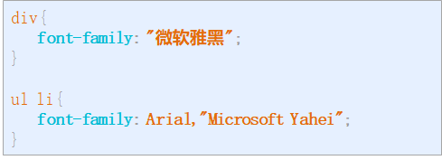

- 但多个单词组成的字体名 用引号

#### 字体大小：
 font-size 属性：设置字体的大小

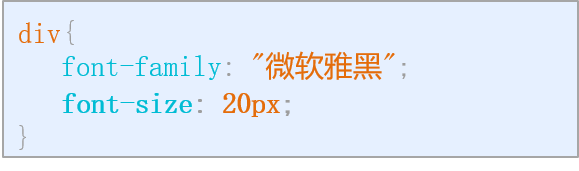

注意：

- px(像素) 是网页中常用的单位

- 开发时尽量设置明确的值 (按设计师的文稿)

- 所有浏览器默认显示的字体大小为 16px

- 可以通过 body 指定整个页面的文字样式

#### 字体粗细：
   font-weight 属性：设置字体的粗细

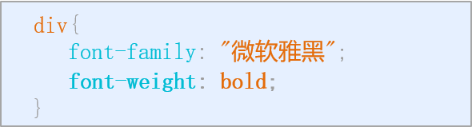


#### 字体样式：

font-style 属性：设置文本的风格

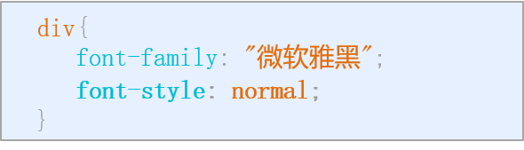

属性限定值：


#### 字体复合属性

font 属性：一次性设置以上多个文字属性

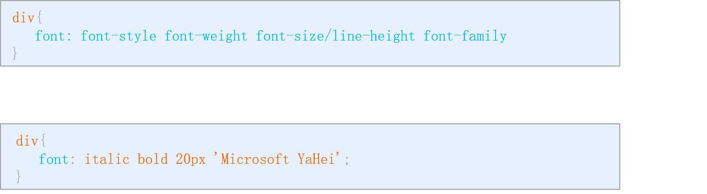

注意：

- 顺序不能更换，属性间用空格分隔

- 可以省略不需要设置的属性（自动取默认值），但 **必须保留** font-size 和 font-family 属性

#### 字体总结：


### 文本样式2：
#### 文本颜色：
​    color 属性用于定义文本的颜色。
语法：

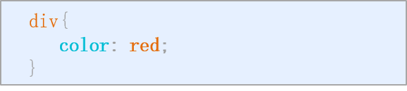

特点：

- 十六进制 颜色 以 # 开头

- RGB 三原色取值范围：0-255

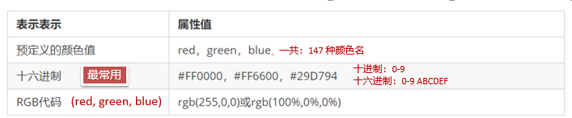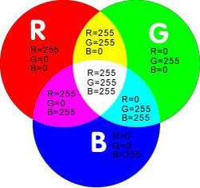

特点：

- 十六进制 颜色 以 # 开头 

- RGB 三原色取值范围：0-255

#### 文本对齐：
text-align 属性：设置标签内文字的水平对齐方式
语法：

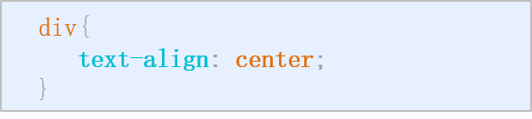

属性限定值：


#### 修饰文本：


text-decoration 属性：设置文字修饰 (下划线等等)

语法：

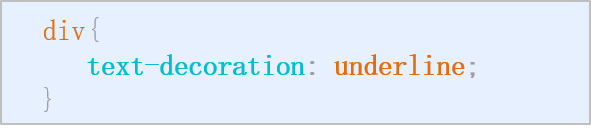

属性限定值：


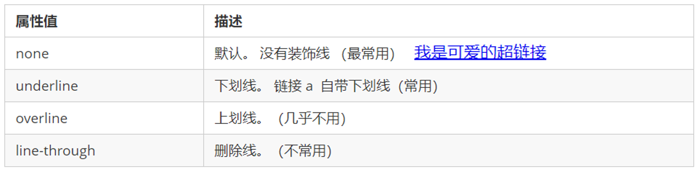

用的最多的 就是 **删除** 或 **添加下划线**

#### 文本缩进

text-indent 属性：设置文本第一行缩进效果

语法：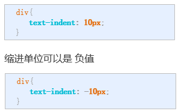


长度单位 

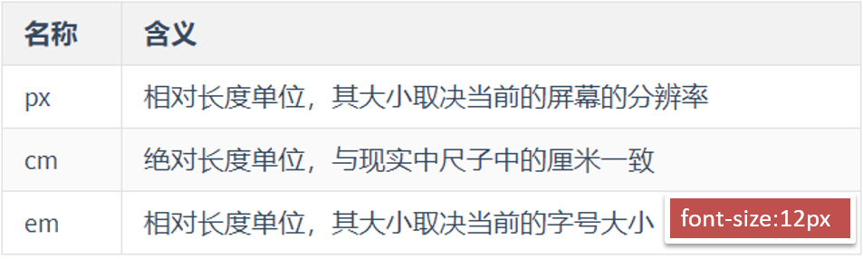

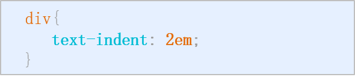

因此: 首行缩进 em 单位使用较多,一般会写2em ,两个文字大小


#### 行间距：
   line-height 属性：设置行高，也就是设置 **行间距**
语法：

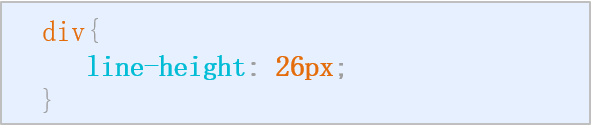

  行高 常用来控制**行间距**

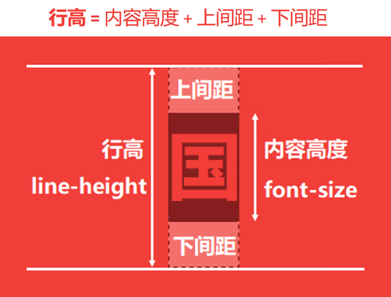

#### 背景属性

##### 背景颜色

background-color 属性：设置标签背景色

语法：

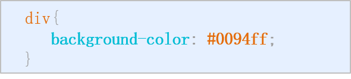

颜色格式：


注意：背景色是 **标签内容** 的 “**背景**”，不会覆盖 标签内容

##### 背景图片

background-image 属性：设置标签背景图片

语法：

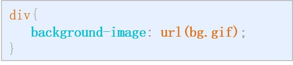

支持图片格式： 

- .gif 

- .jpg 

- .png 

- 等主流格式

注意：背景图 小于 标签大小时，浏览器默认会重复显示图片

#### 文字样式2总结

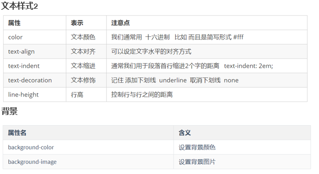

注意：

1. 背景   是 **标签内容** 的 “**背景**”，不会覆盖 标签内容

2. 背景图 小于 标签大小时，浏览器默认会重复显示图片

## 盒子模型

**学习路径**

- 边框
- 内容宽高
- 内边距
- 外边距
- 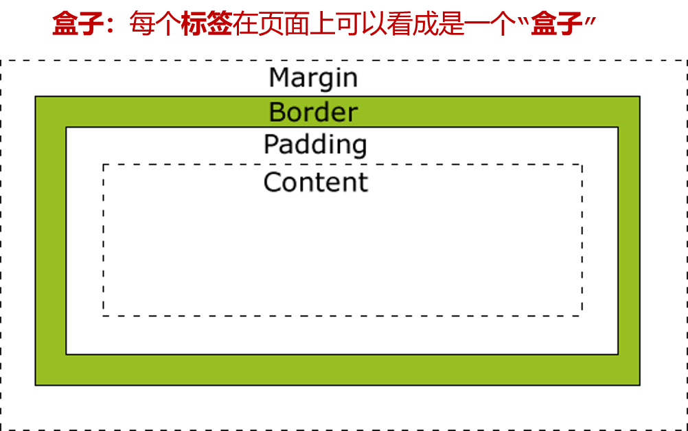

### 边框

边框属性：粗细、样式、颜色

边框方向：上、右、下、左

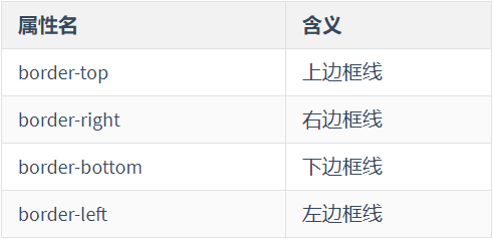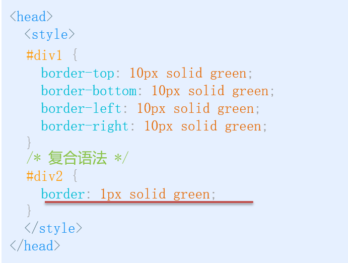

### 内容宽高

宽和高属性

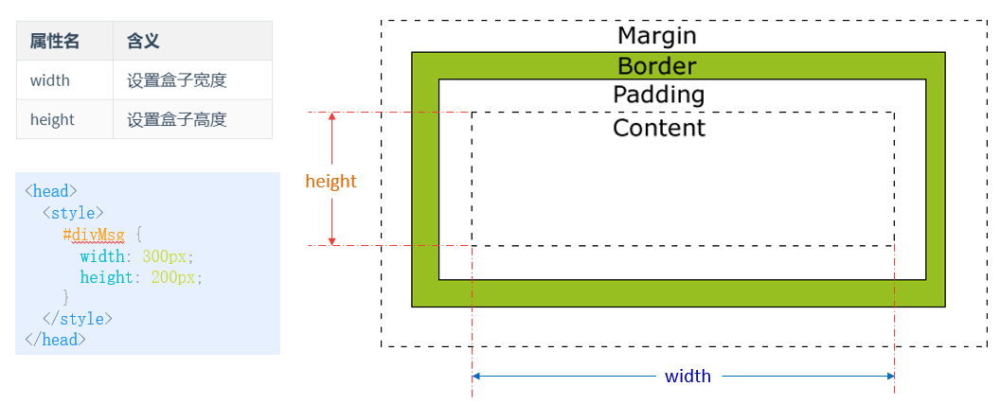

### 内边距

padding 属性："父子" 距离

方向：上、右、下、左

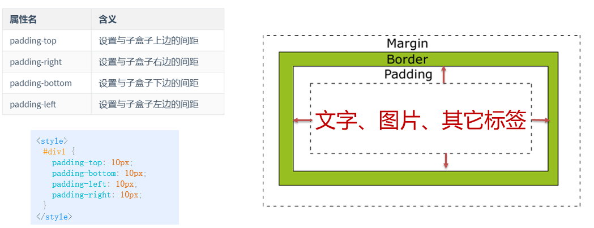

简写:

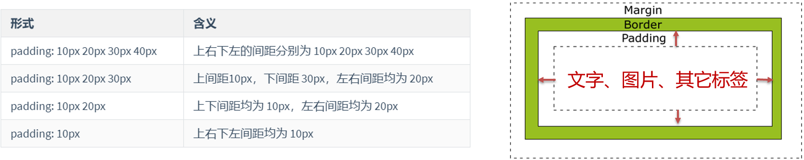

### 外边距

margin 属性："兄弟" 距离，盒子和盒子之间距离
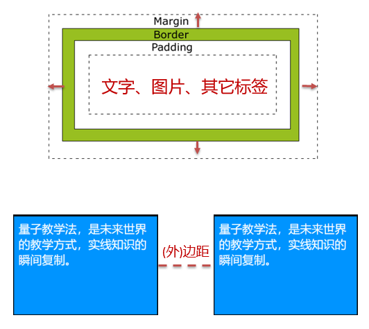

方向：上、右、下、左


**简写方式**
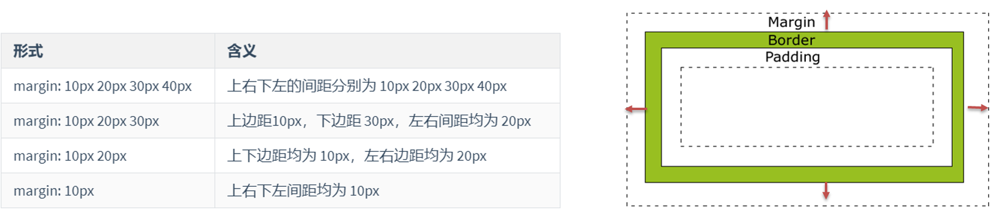

## 完成招聘页面美化

**通过本案例，主要复习：**

- 基础选择器

- 背景图
- 盒子模型 与 行高

## 学员信息页面美化

**通过本案例，主要复习：**

- 组合选择器

- 背景图、背景色

- 盒子模型

- 补充：

  - margin：auto; ( 自动计算剩余值-居中效果 )

  - border-collapse: collapse; ( 合并表格相邻边框 )