## 											day03

## 字体

**学习路径**

- 字体类型
- 字体设置规则

### 字体类型

字体类型分为:  衬线字体、无衬线字体、等宽字体

#### 衬线字体

​	**衬线字体类型（Serif）**的特征：文字笔画粗细不均，开始和结尾有额外装饰

优势：

- 有衬线字体优势是**字号较小**时更容易分辨

- 比较适合应用于大段落文字

- 在报刊书籍中应用比较广泛

  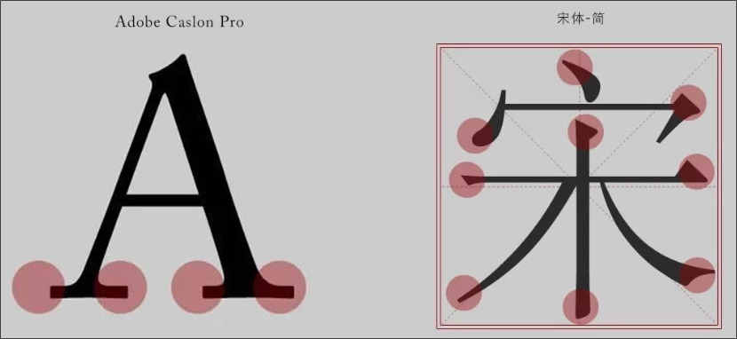

  

#### 无衬线字体

​	**无衬线字体类型（San-serif）**的特征：是文字笔画粗细均匀，但首尾无装饰

优势：

- 相对于衬线字体更具美感

- 在电子屏幕中同等字号显得要大

- 目前网页中大多采用无衬线字体

  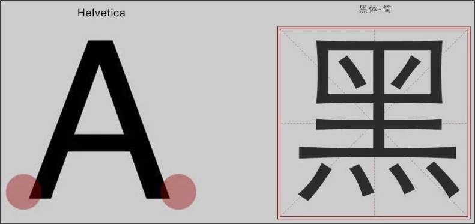

#### 等宽字体

​	**等宽字体类型（monospace）**的特征：单个字母或文字的宽度相等

优势：

- 由于等宽字体文字的宽度相等

- 便于处理文字的对齐

- **一般用于程序代码的编写**

  ​	**如：（ Consolas - 数字0有斜杠 ）**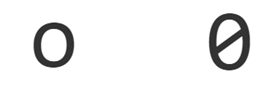

  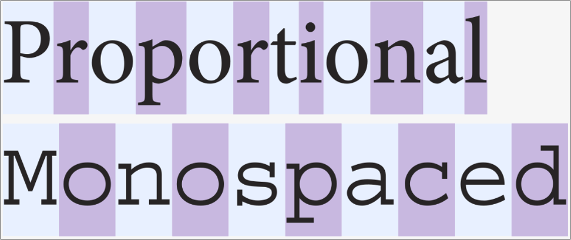

### 系统字体

**不同操作系统**中的浏览器(chrome为例)可以为每种 字体类型 设置 默认字体

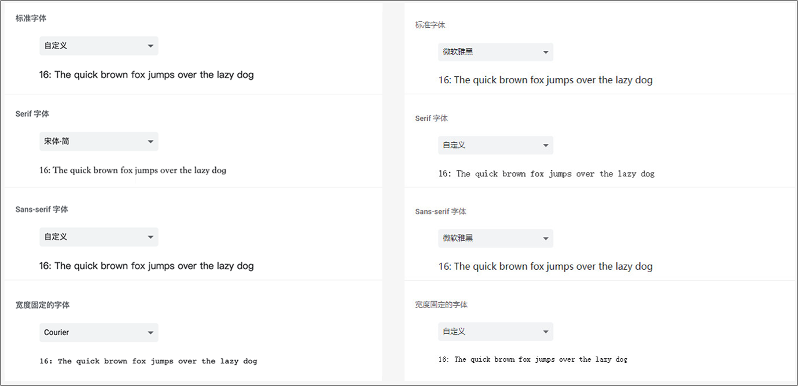

操作系统中可以为每种 字体类型 设置 默认字体

Windows 系统字体

- 宋体（SimSun） 默认的**有衬线字体**

- 微软雅黑（Microsoft Yahei）默认的**无衬线字体**

- Arial 只针对英文的**无衬线字体**

- Windows系统 - C:\Windows\Fonts 目录中可以查看全部字体

Mac OS 系统字体

- 黑体-简（Heiti SC）默认的**有衬线字体**

- 苹方（PingFang SC）默认的**无衬线字体**

- Helvetica 只针对英文的**无衬线字体**

### 字体设置规则

#### 通过 font-family 属性 设置**单个字体**

- 字体名可以是中文，也可以是英文

- 字体名如果是中文或多个单词组成的英文，使用 **引号**

#### 通过 font-family 属性 设置**多个字体**，浏览器从左到右依次查找可用字体

- 为不同语言设置 不同字体

  1. 英文单词 会使用 Arial 
  2. 中文 会使用 Microsoft Yahei

  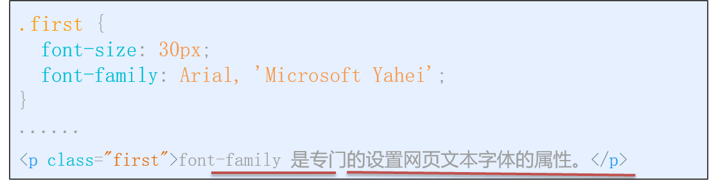

- 为不同系统设置 不同字体

  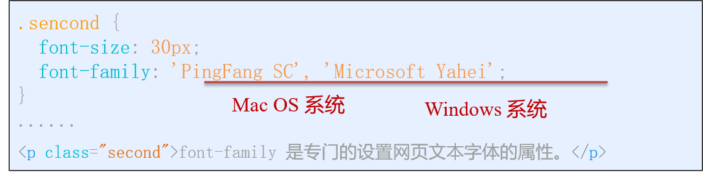

字体小结:

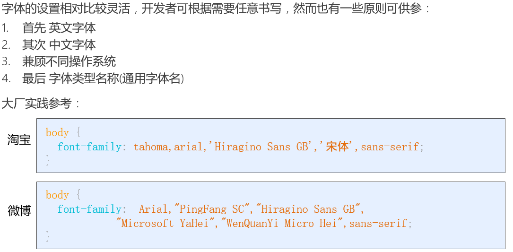

##  背景

**学习路径**

- 背景色
- 背景图片
- 背景平铺
- 背景尺寸
- 背景定位
- 背景附着
- 复合语法
### 背景色

作用：设置元素的背景颜色

语法：

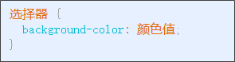

颜色值：

- 颜色名称
- 十六进制 等方式

### 背景图片

作用：设置元素的背景图片

场景：设置 logo、装饰性的小图标、大背景图等

特殊场景：元素中同时需要 文字和图片时

语法：

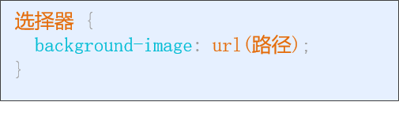

注意：路径不要加引号

### 背景平铺

当**背景图**尺寸小于**元素**尺寸时，需要特殊处理

语法：需要 与 背景图属性 一起使用

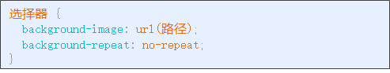

属性值:

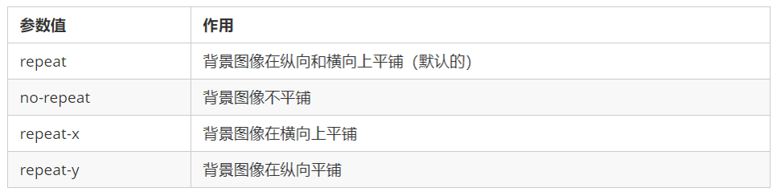

### 背景尺寸

l概念：当背景图不平铺，可以直接指定背景图**尺寸**

语法：背景图一般设置为 不平铺

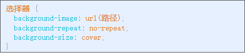

属性值：

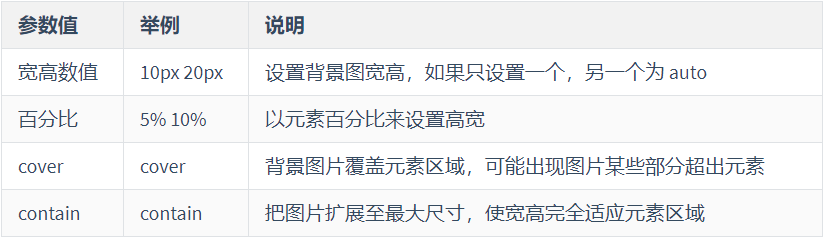

### 背景定位

作用：可以指定 **图片** 在 **背景** 中的位置

语法：与 背景图属性 一起使用

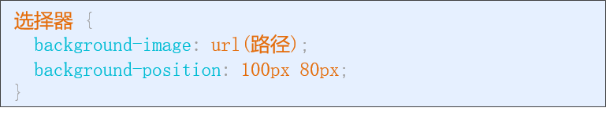

属性值：

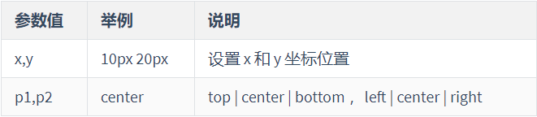

**方位词 注意：**

- 如果 方位词 只设置一个，那另一个默认为center

- 由于是方位词，所以 p1,p2 顺序无关

### 背景附着

作用：设置 背景图 是否 跟随滚动

语法：

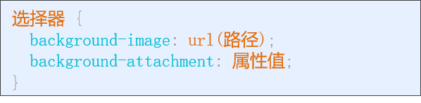

属性值：

### 复合语法

举例：

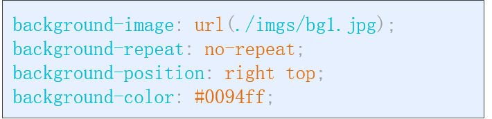

背景的相关属性比较多，这么多属性一个个设置太麻烦，我们可以一次性设置多个背景属性

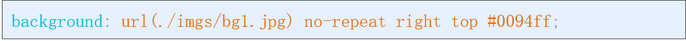

**注意：**

- 多个属性间 **没有** 顺序限制

- **推荐顺序：**背景颜色 图片url 背景平铺 背景图滚动 背景图片位置

### 背景小结

背景属性:
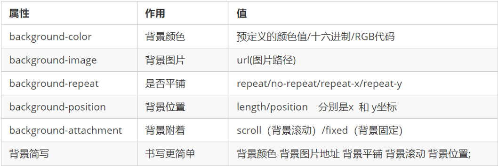

背景尺寸设置:
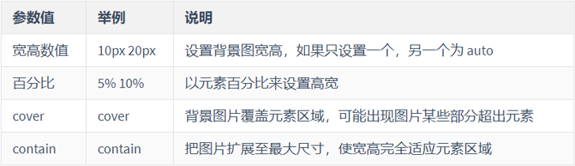

### 背景属性进阶 ( 精灵图 )

概念：**精灵图**(雪碧图)是一种包含若干小图片的大图片

**好处：减少网络请求次数（后面细讲）**

使用步骤：

- 设置容器元素的 合适宽高

- 设置容器元素的 背景图为 精灵图

- 设置容器元素的 背景图位置 x , y

背景图位置 技巧

- X 轴 正数往**右**，负数往**左**

​    - Y 轴 正数往**下**，负数往**上**

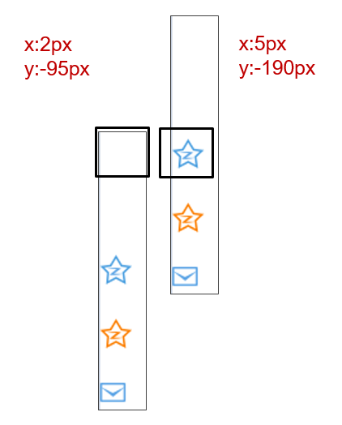

## CSS特征

**学习路径**

- 层叠性

- 优先级

- 继承性

### 层叠性

多个选择器应用到同一个元素时，各个选择器中不同的**样式属性**会**叠加**到**一起**应用到元素上

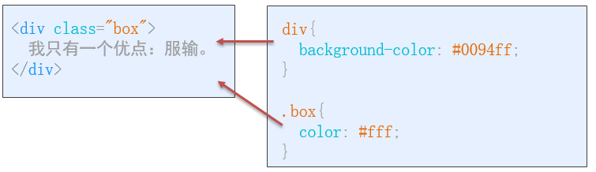

多类名场景：在标签的 **class**属性 中使用 **多个类名**

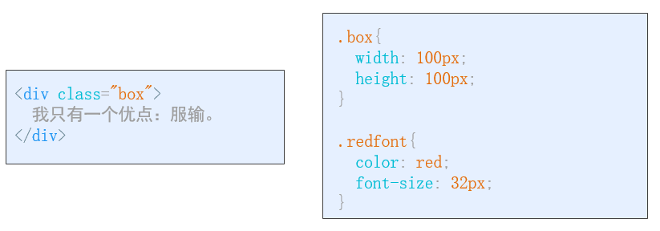

注意：

- 多个类名间用 空格 分开

- 可以写 若干个类名

- 多个选择器的样式属性 会应用到 当前元素标签

**好处：**一定程度上复用选择器中的样式属性代码

### 优先级

概念：当**多个选择器**中的样式 作用于**同一个元素**时，**相同样式属性**可能出现**不同的值**

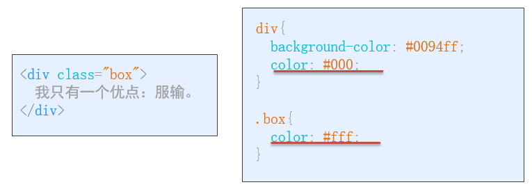

规则：

- 标签选择器 < 类选择器 < id选择器 < 行内样式 < !important

- 选择器优先级相同时，**后面**的优先级更高

### 继承性

概念：父元素设置的 CSS样式，会自动被应用到子元素

简而言之：父元素有的样式，子元素也有

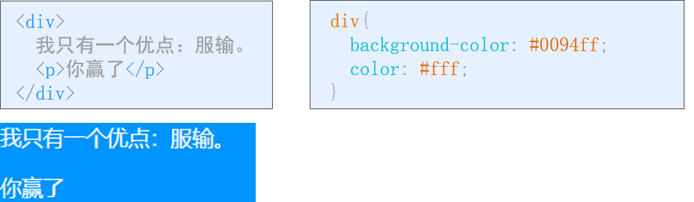

**注意: **如果父元素和子元素样式有重复的，则 子元素优先级更高

## 虾米音乐

**思路：**

整体分 页头 和 主体 

页头：

- 背景色，logo

主体：

- 左侧功能列表

- 中间歌曲列表

- 右侧专辑封面

**语义化标签**

- 布局时，通常用div

- 但那么多div，不容易分辨

- 所以html5就出了语义化标签

- 相比于 div，可以让标签作用一目了然

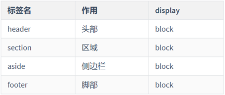