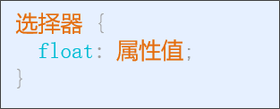

## css第二天

## emmet语法

### 快速生成HTML结构

### 快速生成css属性

生成的css属性单位：默认为 px，可以直接指定其他单位，如： lh26em

## 组合选择器

#### 后代选择器(包含选择器)

作用：可以选择**某标签包含的**所有后代标签

#### 并集选择器

作用：可以让**多个选择器**共享一套样式

#### 交集选择器

作用：将至少两个选择器连在一起使用（既要还要）

**选择器总结**

## 文档流与元素类型

**学习路径**

- 什么是 文档流
- 元素的显示模式
- 元素显示模式的转换
- 块级元素的特殊处理

### 文档流

文档流：是浏览器在显示（渲染）网页标签时所采用的一套**排列规则**

- 块级元素 上下排列：独占一行

- 行内元素 水平排列：默认从左到右，遇到障碍或宽度不够会自动换行

- 行内块元素 等...

### 元素显示模式

元素显示模式：就是 元素(标签) 以什么方式进行显示，如 ：

- div 独占一行

- span 不独占一行，一行中可以放多个 span

常见元素显示模式类型：

- 块级元素 (容器级) 

- 行内元素 (文本级)

- 行内块元素

#### 块元素

常见**块级元素**：h1~h6、p、div、ul、li、ol、dl、dt、dd、table、form 等

典型：**div**

特点：

- **容器级**，可以放 行内 或 块级元素

- 霸道，独占一行

- 宽高、内外边距 都可直接控制

- 宽度默认为父元素的 100%

- 高度默认由内容撑起来

注意：

- p 标签 主要用于存放文字，不能放其它块级元素

- h1-h6 标题标签 也是存放文字用的

#### 行内元素

常见**行内元素**：span、a、label、b、i、u、s、em、mark、code、small、strong 等

典型：**span**

特点：

- **文本级**，一般只放 文本 或 其它行内元素

- 和相邻行内元素在一行，一行可以显示多个，行满后另起一行

- 不占有独立区域，只靠**自身内容**尺寸来支撑高宽

- 宽高 无法直接设置

- 外边距 左右有效，上下无效；内边距都有效；

注意：

- 超链接 里 一般放文字，也可以放 img 标签，但不能再放 超链接 

#### 行内块元素

常见**行内块元素**：img、video、audio、input、button、select、textarea 等

典型：**img**

特点：兼有 行内元素 和 块级元素特点

- 和相邻行内元素（行内块）在一行，中间有空白间隙

- 一行可以显示多个，行满后另起一行

- 宽高默认值就是它本身内容的宽高

- 宽高和内外边距有可以控制

**总结:**

### 元素显示模式的转换

不同类型的显示模式 可以进行 转换

语法：

### 块级元素的特殊处理

#### 文本换行

规则：

- 中文、日文、韩文等遇到边界自动会换行

- 英文按照 单词 会自动换行

- 英文连续**长单词**不会换行

文本内容多时，有时会需要强制换行

语法：

文本内容多时，有时会需要强制不换行

语法：

#### 溢出处理

块级元素内容占满**高或宽**后怎么办呢？

溢出处理

- 自动换行

- 滚动条

语法：

#### 外边距合并

文档流中，相邻 **块级元素** **上下外边距**会出现**合并现象**

使用外边距较大的值来撑开距离

#### 外边距塌陷

   在文档流中块级元素的子盒子设置了上外边距后，会产生子盒子外边距溢出父盒子的现象，我们称之为塌陷。

**解决方案：**

- 为父盒子 设置 border 属性

- 为父盒子 设置 overflow 属性( 值不为 visible)

## 浮动

### 为什么需要浮动？

有很多的布局效果，标准流没有办法完成，此时就可以利用浮动完成布局。 因为浮动可以改变元素标签默认的排列方式.

比如: 

- 让多个 **块级元素（****div****）**排成一行显示
- 让**两个 块级元素** 分别显示在 **左右两边**

结论：有很多布局，标准流（自上而下）无法完成

解决办法：有很多，其中，**浮动** 就是一种常见方式

浮动作用：让多个块级元素一行内显示

### 什么是浮动?

作用：让 **元素** 脱离标准流，**漂浮** 到 标准流上面；并能设置同行显示。

语法：

属性值：

### 浮动特点:

元素浮动后，会有3个比较重要的特点：

#### 浮动元素 会 脱离标准流(脱标)

设置 float 属性后，元素会有两个表现：

1. 离开标准流（脱标），移动到指定的位置
2. 浮动的元素不再拥有原来的位置，位置被 标准流 **后面的元素** 前移占据
3. **文字**不识别 元素标签的**浮动**，所以会**围绕**浮动元素的"空出位置"进行布局

#### 浮动元素 会 一行内显示并且元素顶部对齐

如果多个元素都设置了浮动：

1. 它们会按照属性值 在一行内显示
2. 多个浮动元素会保持顶端对齐

两个细节：

- 浮动方向相同的元素**紧挨**在一起（无缝隙）

- 如果父级宽度装不下这些浮动的盒子， 多出的盒子会 **换行**

#### 浮动元素 会 具有行内块元素的特性（成行显示，可设置高宽）

任何类型的元素都可以浮动，浮动后都具有 **行内块元素** 特性：

- 成行显示

- 宽高由内容决定

- 宽高可设置

## 清除浮动

原因: 元素浮动后，会脱标

### 三个问题场景：

1. 浮动后，标准流后的元素不补位

2. 父元素宽度不够时，内部的浮动子元素高度不一，可能卡住换行的浮动子元素

3. 父元素不设置高度，一旦子元素浮动，父元素高度将无法撑住

### 解决办法: 清除浮动

1. 使用 clear 属性，解决 前两个场景 问题

2. 使用 overflow 属性，解决 父盒子 丢失高度问题

### 清除浮动方法1

语法：

属性值：

**本质：**清除浮动元素造成的影响，让**其他元素**认为浮动元素没有浮起来

## 导航案例

**通过本案例，主要复习：**

并集选择器

盒子模型

行内块元素 ( display: inline-block )

补充：

- 鼠标指针样式 （ cursor: pointer ）

- 去掉元素间距的小技巧 ( font-size: 0 )

## 商品卡片

**通过本案例，主要复习：**

盒子模型

浮动

补充：

- i 标签（斜体标签）

- small 标签（缩小字体标签）