# css第一天

## css介绍

**1.HTML** **的局限性**

- HTML ：负责组织 网页的**结构和内容**
- 局限性：页面不够 **"****美丽"**

**2.CSS** **网页的美容师**

- CSS：层叠样式表，简称 **样式表**
- 作用：负责给网页做 **美容**

HTML 和 CSS 关系：

**内容、结构**  和 **页面美化**

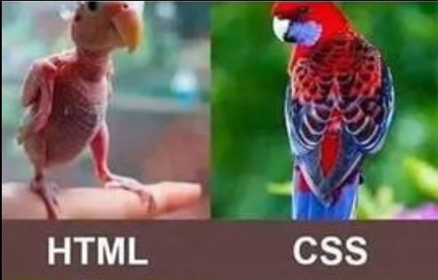

## css语法规则:

### 书写位置

三种书写位置

- 行内：写在目标标签 中

- **内嵌：写在** **<style></style>** **标签中**(学习过程中使用最多)

- 外部：写在 .css 文件，再通过 <link> 标签引入到 html 页面中

语法：

- **内嵌样式表** 写在 一对 style 标签中，style 标签 一般写在 head 标签中

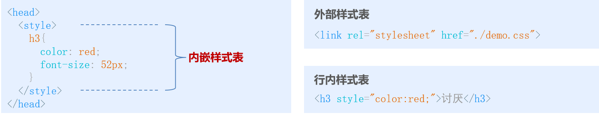

### 基本语法规范

```css
 CSS语法由 两部分 组成

   选择器：就是用来选择 要使用样式表的标签 的语法

   样式表：各种样式的声明（如：字体颜色，大小等）
```


1. 样式表

语法：

- 属性名和属性值 以 **键值对** 形式表示

- 属性**名值**间 用 英文冒号 ":" 隔开

- 属性**键值对** 用 英文分号 ":" 隔开 


### 代码风格:

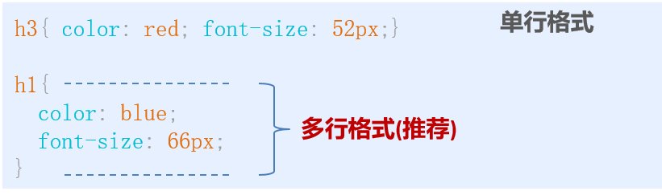

注意：

- 全部英文都是用小写（特殊情况除外）

## css选择器:

### 基础选择器:

选择器的作用：**选择标签**

#### 标签选择器

概念：是指用 HTML标签名 作为选择器，为页面中某一种标签设定 CSS样式

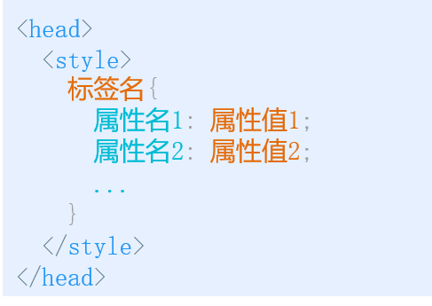

**缺点：只能针对某一种标签设置样式，无法差异化**

#### 类选择器

**类选择器(class选择器)**

- 通过 class属性值 来查找标签
- 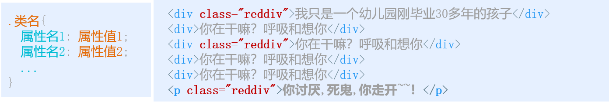

#### id选择器

- 通过 id属性值 来查找标签
- 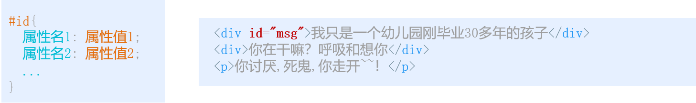

id与class的区别

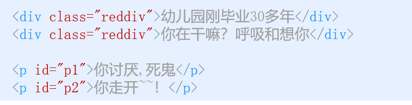

- **class(类名)** 类似 人的名字，有重名的情况

- **id** 类似 人的身份证号，国内唯一，不会重复
- 使用：**类选择器** 开发时用的最多

#### 通配符选择器

查找页面中所有标签

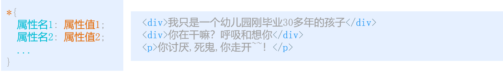

基础选择器总结

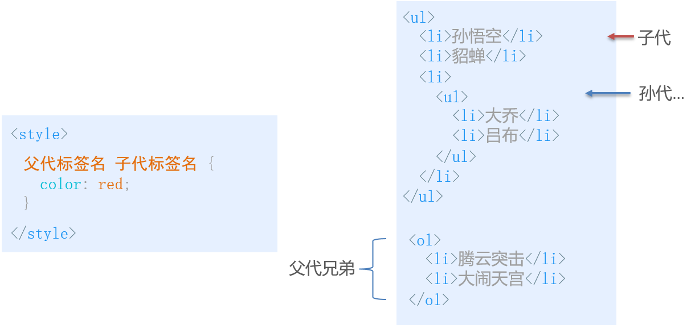

每个基础选择器都有适用的场景，其中 类选择器 用的相对最多

## 组合选择器

- 后代选择器(包含选择器)
    作用：可以选择某标签包含的所有后代标签
- 并集选择器
    作用：可以让多个选择器共享一套样式
- 交集选择器
    作用：将至少两个选择器连在一起使用


## CSS 常见样式属性:

### 文本样式1

#### 字体系列:

#### 通过 font-family 属性 设置**单个字体**

- 字体名可以是中文，也可以是英文

- 字体名如果是中文或多个单词组成的英文，使用 **引号**

#### 通过 font-family 属性 设置**多个字体**，浏览器从左到右依次查找可用字体

- 为不同语言设置 不同字体

  1. 英文单词 会使用 Arial 
  2. 中文 会使用 Microsoft Yahei

  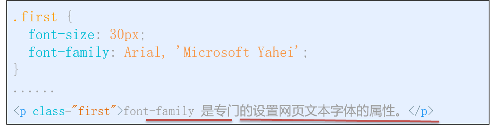


### 字体小结:


#### 字体大小：
 font-size 属性：设置字体的大小

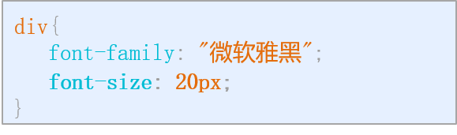

注意：

- px(像素) 是网页中常用的单位

- 开发时尽量设置明确的值 (按设计师的文稿)

- 所有浏览器默认显示的字体大小为 16px

- 可以通过 body 指定整个页面的文字样式

#### 字体粗细：
   font-weight 属性：设置字体的粗细

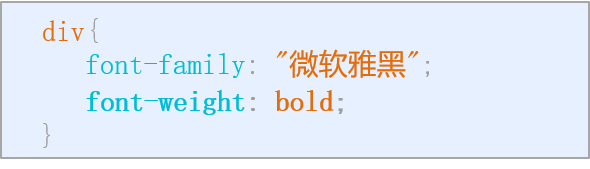


#### 字体样式：

font-style 属性：设置文本的风格

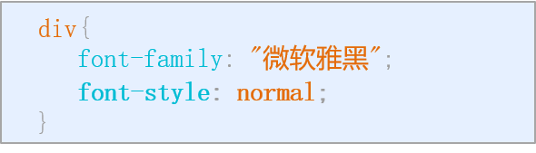

属性限定值：


#### 字体复合属性

font 属性：一次性设置以上多个文字属性

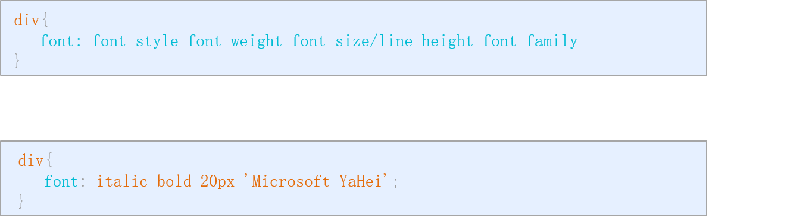

注意：

- 顺序不能更换，属性间用空格分隔

- 可以省略不需要设置的属性（自动取默认值），但 **必须保留** font-size 和 font-family 属性

#### 字体总结：


### 文本样式2：
#### 文本颜色：
​    color 属性用于定义文本的颜色。
语法：

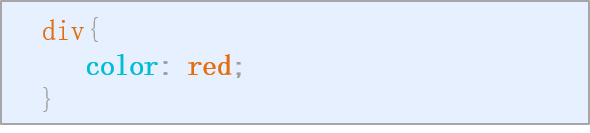

特点：

- 十六进制 颜色 以 # 开头

- RGB 三原色取值范围：0-255

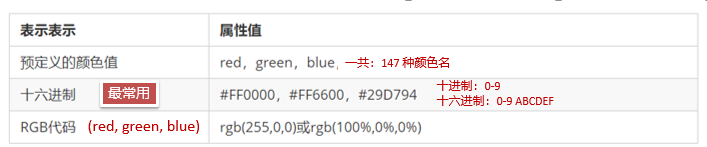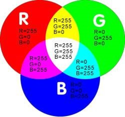

特点：

- 十六进制 颜色 以 # 开头 

- RGB 三原色取值范围：0-255

#### 文本对齐：
text-align 属性：设置标签内文字的水平对齐方式
语法：

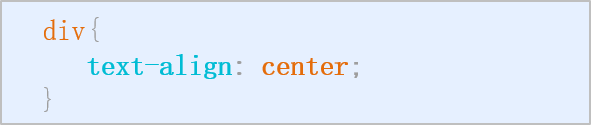

属性限定值：


#### 修饰文本：


text-decoration 属性：设置文字修饰 (下划线等等)

语法：

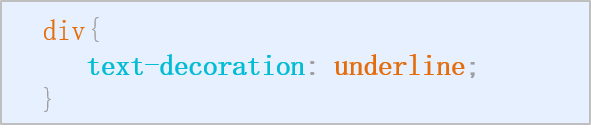

属性限定值：


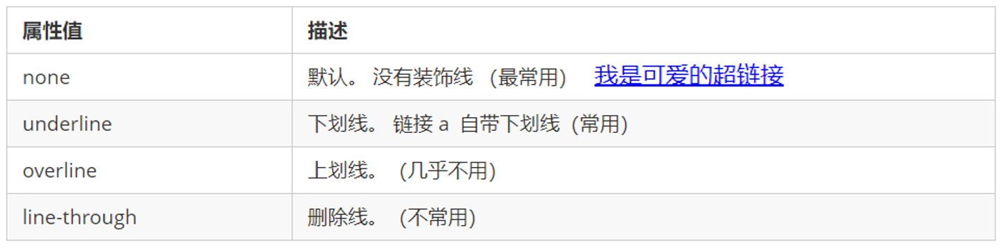

用的最多的 就是 **删除** 或 **添加下划线**

#### 文本缩进

text-indent 属性：设置文本第一行缩进效果

语法：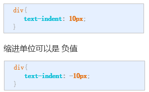


长度单位 

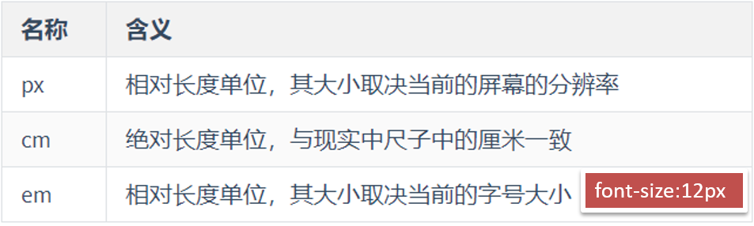

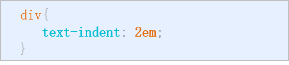

因此: 首行缩进 em 单位使用较多,一般会写2em ,两个文字大小


#### 行间距：
   line-height 属性：设置行高，也就是设置 **行间距**
语法：

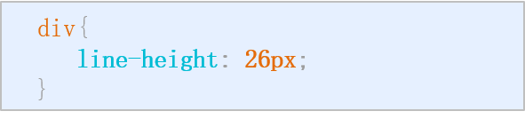

  行高 常用来控制**行间距**

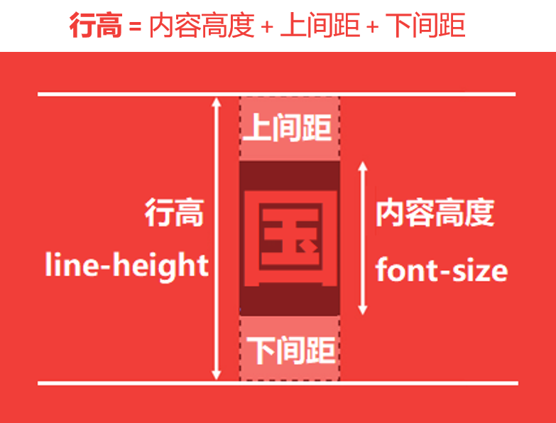

#### 背景

**学习路径**

- 背景色
- 背景图片
- 背景平铺
- 背景尺寸
- 背景定位
- 背景附着
- 复合语法

##### 背景色

作用：设置元素的背景颜色

语法：

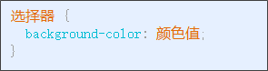

颜色值：

- 颜色名称
- 十六进制 等方式

颜色格式：

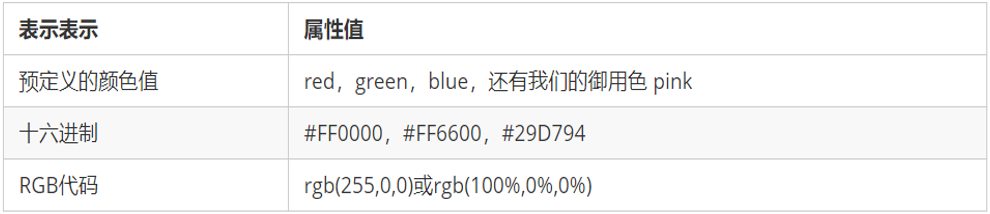

注意：背景色是 **标签内容** 的 “**背景**”，不会覆盖 标签内容

**拓展**

rgba: 可以采用带有alpha通道的透明色彩值来设定半透明的背景色效果

currentcolor: currentcolor的值由color值来决定，color值可以继承自父级元素

**背景图片**

作用：设置元素的背景图片

场景：设置 logo、装饰性的小图标、大背景图等

特殊场景：元素中同时需要 文字和图片时

语法：


注意：路径不要加引号

支持图片格式： 

- .gif 

- .jpg 

- .png 

- 等主流格式

注意：背景图 小于 标签大小时，浏览器默认会重复显示图片

**拓展**

多背景图片：background-image: url(),url();

### 背景平铺

当**背景图**尺寸小于**元素**尺寸时，需要特殊处理

语法：需要 与 背景图属性 一起使用

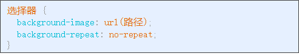

属性值:

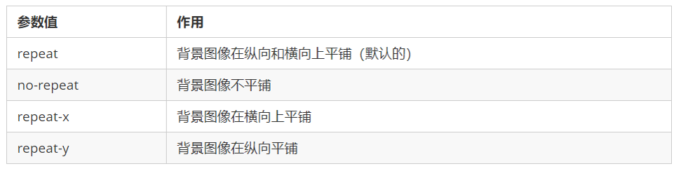

  **拓展：**

​         space： 均匀分布

​		 round： 缩放分布

### 背景尺寸

l概念：当背景图不平铺，可以直接指定背景图**尺寸**

语法：背景图一般设置为 不平铺

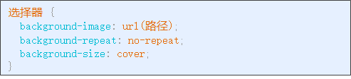

属性值：

| 参数值  | 举例                          | 说明                                                         |
| ------- | ----------------------------- | ------------------------------------------------------------ |
| auto    | background-size: auto;        | 默认值，背景原始大小                                         |
| 两个值  | background-size: 150px 100px; | 第一个值是宽度，第二个值是高度                               |
| 两个值  | background-size: 100% 100%;   | 不管图片大小如何,将图片的尺寸精确定义成和背景区域一样大小，就算拉伸变形也无所谓 |
| 一个值  | background-size: 150px;       | 第一个值是宽度，第二值根据第一个值等比缩放                   |
| cover   | background-size: cover;       | 不管图片大小如何,就算超出了容器区域，也等比缩放到把整个背景区域填满 |
| contain | background-size: contain      | 不管图片大小如何,就算父容器有多余的空白，也等比缩放完整呈现  |


### 背景定位

作用：可以指定 **图片** 在 **背景** 中的位置

语法：与 背景图属性 一起使用

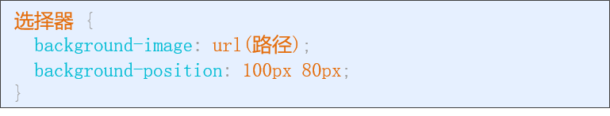

属性值：

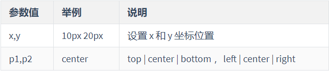

**方位词 注意：**

- 如果 方位词 只设置一个，那另一个默认为center

- 由于是方位词，所以 p1,p2 顺序无关

### 背景附着

作用：设置 背景图 是否 跟随滚动

语法：

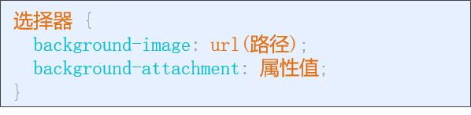

属性值：

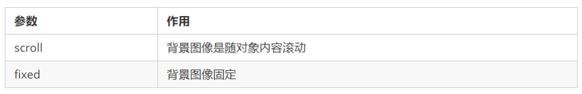

### 复合语法

举例：

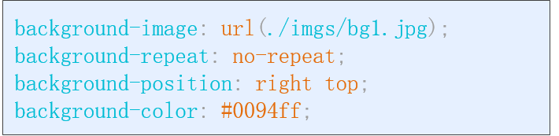

背景的相关属性比较多，这么多属性一个个设置太麻烦，我们可以一次性设置多个背景属性

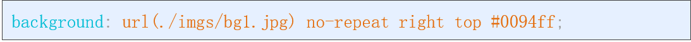

**注意：**

- 多个属性间 **没有** 顺序限制

- **推荐顺序：**背景颜色 图片url 背景平铺 背景图滚动 背景图片位置

### 背景小结

背景属性:
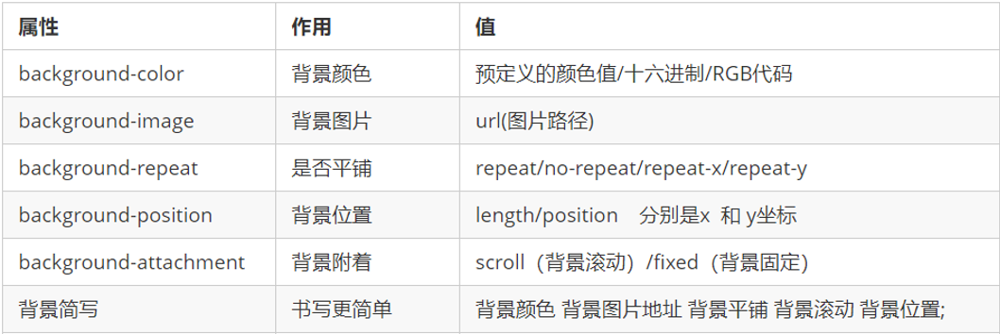

背景尺寸设置:
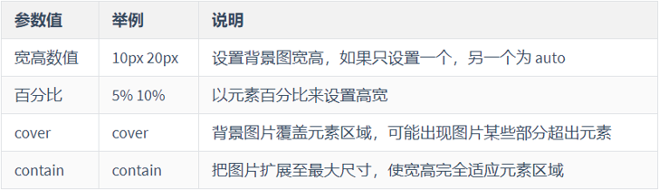

### 背景属性进阶 ( 精灵图 )

概念：**精灵图**(雪碧图)是一种包含若干小图片的大图片

**好处：减少网络请求次数（后面细讲）**

使用步骤：

- 设置容器元素的 合适宽高

- 设置容器元素的 背景图为 精灵图

- 设置容器元素的 背景图位置 x , y

背景图位置 技巧

- X 轴 正数往**右**，负数往**左**

​    - Y 轴 正数往**下**，负数往**上**

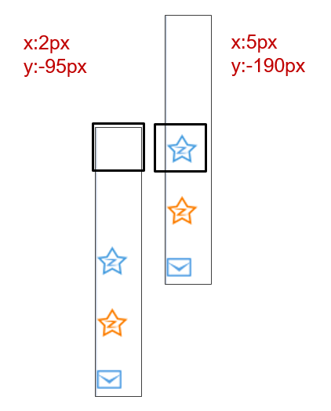

## CSS特征

**学习路径**

- 层叠性

- 优先级

- 继承性

### 层叠性

多个选择器应用到同一个元素时，各个选择器中不同的**样式属性**会**叠加**到**一起**应用到元素上

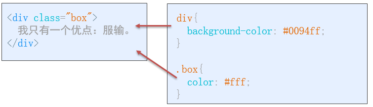

多类名场景：在标签的 **class**属性 中使用 **多个类名**

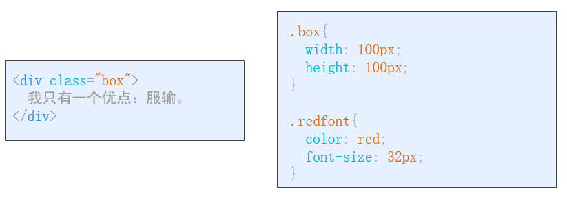

注意：

- 多个类名间用 空格 分开

- 可以写 若干个类名

- 多个选择器的样式属性 会应用到 当前元素标签

**好处：**一定程度上复用选择器中的样式属性代码

### 优先级

概念：当**多个选择器**中的样式 作用于**同一个元素**时，**相同样式属性**可能出现**不同的值**

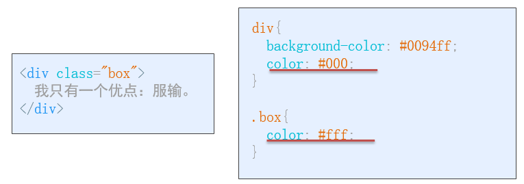

规则：

- 标签选择器 < 类选择器 < id选择器 < 行内样式 < !important

- 选择器优先级相同时，**后面**的优先级更高

### 继承性

概念：父元素设置的 CSS样式，会自动被应用到子元素

简而言之：父元素有的样式，子元素也有

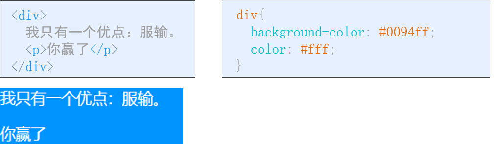

**注意: **如果父元素和子元素样式有重复的，则 子元素优先级更高

#### 文字样式2总结

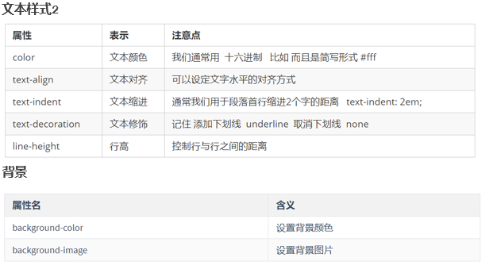

注意：

1. 背景   是 **标签内容** 的 “**背景**”，不会覆盖 标签内容

2. 背景图 小于 标签大小时，浏览器默认会重复显示图片

## 盒子模型

**学习路径**

- 边框
- 内容宽高
- 内边距
- 外边距
- 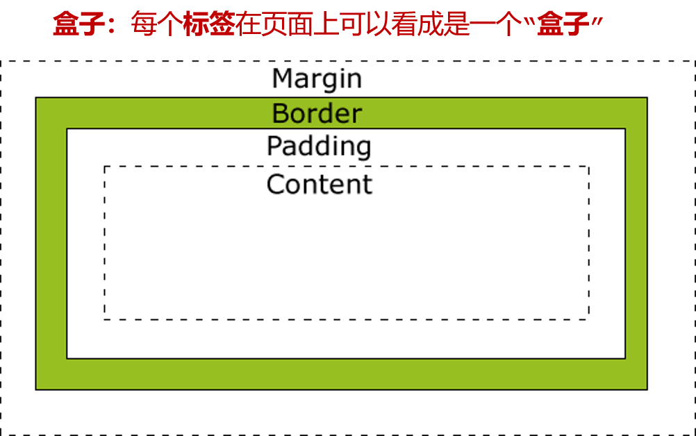

### 边框

边框属性：粗细、样式、颜色

边框方向：上、右、下、左

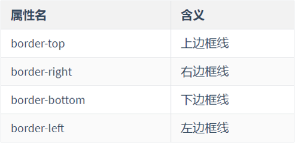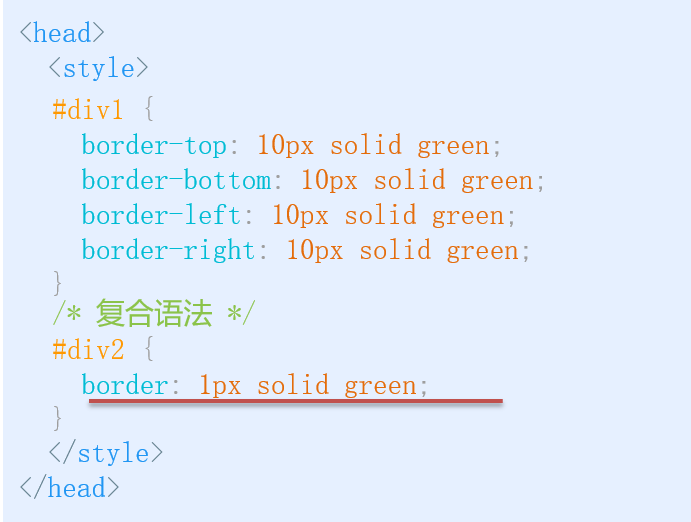

### 内容宽高

宽和高属性

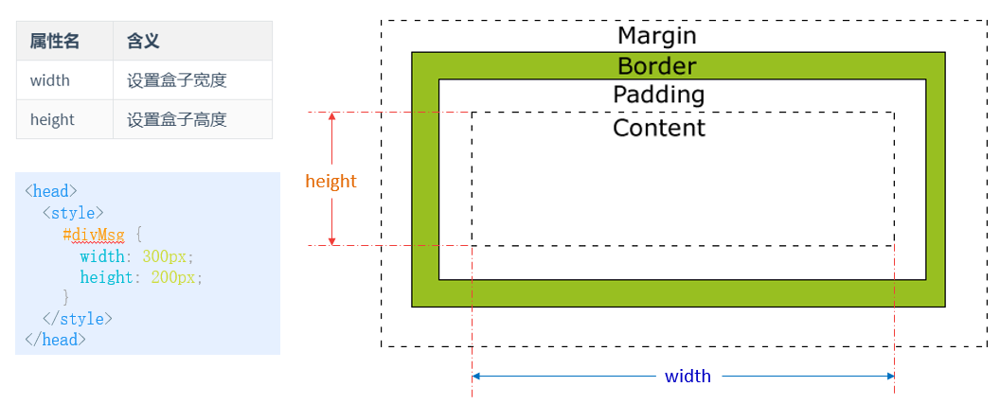

### 内边距

padding 属性："父子" 距离

方向：上、右、下、左

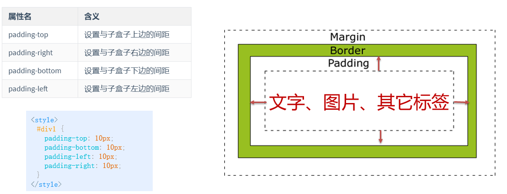

简写:

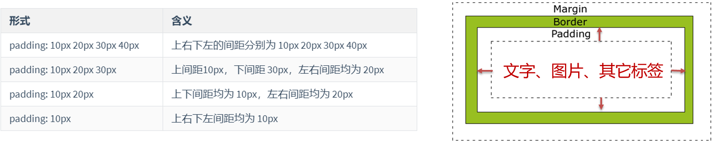

### 外边距

margin 属性："兄弟" 距离，盒子和盒子之间距离


方向：上、右、下、左


**简写方式**


## 完成招聘页面美化

**通过本案例，主要复习：**

- 基础选择器

- 背景图
- 盒子模型 与 行高

## 学员信息页面美化

**通过本案例，主要复习：**

- 组合选择器

- 背景图、背景色

- 盒子模型

- 补充：

  - margin：auto; ( 自动计算剩余值-居中效果 )

  - border-collapse: collapse; ( 合并表格相邻边框 )