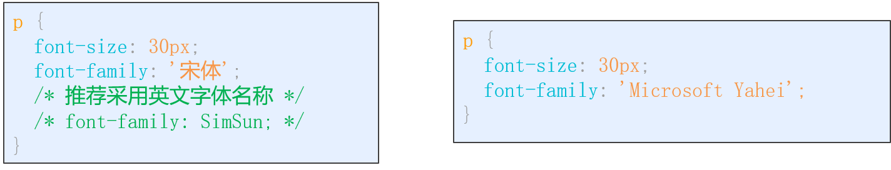
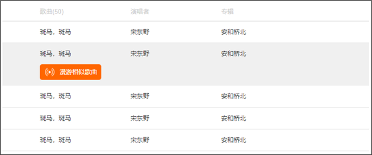
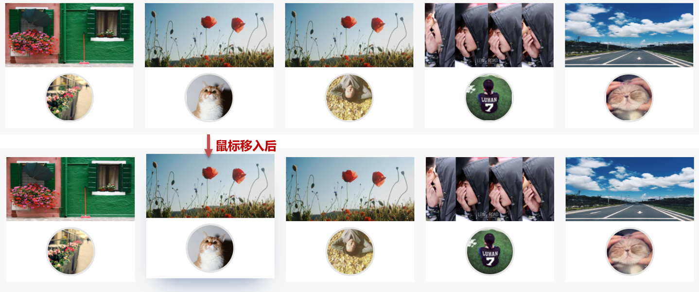

## 第六天

## 元素装饰

**学习路径**

- 阴影

- 透明

### 阴影

#### 盒子阴影

通过 box-shadow 为盒子设置阴影效果

语法：

```css
 box-shadow: -15px -5px 10px 0px #ccc;
```


属性值：



#### 文字阴影
通过 text-shadow 为盒子设置阴影效果

语法：


属性值：


### 透明

#### opacity

l通过 opacity 为盒子设置透明度

语法：

```css
div {
	opacity: 0.3;
}
```

注意：

- 属性值没有单位
- 盒子与所有子元素都会被设置为透明效果
- 透明度取值 0~1 (小数时，推荐省略0)

#### rgba

通过 rgba 设置**颜色透明度**

语法：

```css
div {
  background-color: rgba(37, 169, 245, .3);
}
```

注意：

- 前面3个是设置 三原色

- alpha 取值范围 0~1

- 只针对本身颜色设置透明度

补充：

+ 不同颜色格式可以转换，16进制的 ff 转成 10进制后 就是 255

+ 如：#ffffff 相当于 rgb(255,255,255)

+ 小技巧：css调试中， 【shift+单击】颜色块，可以切换颜色格式

## 伪类选择器

### 鼠标伪类

作用：是依据**鼠标**的**悬停状态**为元素设置样式

语法:   **选择器:hover{ }**

.

注意：":" 是伪类选择器的语法标记

### 超链接伪类

作用：是为**链接的不同访问状态**设置不同的样式

语法：


注意：

- 这四个伪类选择器 必须 按照固定顺序书写： 1.link -> 2.visited -> 3.hover -> 4.active 

- **记忆方式**："爱恨准则" ， **L**o**V**e **HA**te

- 超链接有默认样式

### 焦点伪类

:focus 伪类选择器 一般用在 **表单元素** 获取焦点时

语法:


技巧：可以通过 **鼠标点击** 或 **tab** **键** 切换页面上 元素的焦点

### 伪类选择器小结

**伪类选择器有两类：**

- 专用于 **超链接** 

- 可用于 **所有标签**

  

### 结构伪类选择器

作用：根据**元素**在文档中所处的位置，来**动态**选择元素，常用查找**父级选择器**中的子元素

好处：减少HTML文档对ID或类的依赖，有助于保持代码干净整洁


注意： ul > li:first-child{ 样式 } 

- 可以使用父选择器，来指定查找子元素的搜索范围

- 伪类选择器去查找时，只查找规定类型的标签

#### nth-child(n)扩展

**作用：**选择某个父元素的一个或多个特定的子元素

**用法：**

- n 可以是数字，就是根据顺序选择第 n 个子元素， (注意：序号从1开始)

- n 可以是关键字：even 偶数，odd 奇数

- n 可以是公式：常见的公式如下


如果用到了字母n，那么n的取值范围（0-最后一个元素的序号）

#### 其他伪类选择器


##### :empty

选取 **没有任何子元素**（包括文本）的元素


**注意：空格也算内容，不会被** **:empty** **匹配到**

#### :not(选择器)

选择 **不符合** **括号中选择器** 的标签


### 选择器小结

基本选择器：id / class / 标签

复合选择器:


伪类选择器


结构伪类选择器


## 过渡

**学习路径**

- 过渡时长
- 过渡延时
- 过渡属性
- 过渡曲线
- 复合属性

### 什么是过渡

​	好处：为 CSS 样式切换时添加过渡效果，增强网页交互体验

​	**过渡：**实际上是为元素样式发生改变时添加一种视觉效果

### 过渡时长

过渡时长：是指样式从一种状态变成另外一种状态所持续的时长，以 s（秒）为单位，支持小数

语法：

### 过渡延时

过渡延时：是指延迟执行样式的变化，同样以秒为单位

语法：

作用：等 3秒后，再开始过渡效果

简而言之：就是等一会再执行过渡效果

### 过渡属性

l过渡属性：过渡效果 可以**指定针对**某个样式属性（**默认**是针对所有样式属性都生效）

语法: 

### 过渡曲线

过渡曲线：指**过渡效果**执行过程中**速度变化**的曲线

语法:


属性值：


### 复合属性

语法:


注意：

- 默认对所有样式属性都应用过渡效果（all）

- 大部分样式属性支持过渡效果，但有些不支持，如：position、z-index

- 设置过渡时，除过渡时长不能省略，其它都能省略

- 设置过渡时，除过渡延时必须在过渡时长之后，其它没有顺序要求

## 综合案例

### 用户卡片

**通过本案例，主要复习：**

- 伪类选择器

- 子代选择器

- 盒子阴影

- 圆角

- 过渡效果

**思路：**

- 父盒子与子盒子

- 左浮动

- 悬停阴影效果

- 过渡效果



### 京东推荐

**通过本案例，主要复习：**

- 超链接 伪类选择器

- 圆角

- 过渡效果

- 透明

**思路：**

- 整体结构

- tab菜单 用 ul li 

- 内容区 在第四天写过

- 加入一些过渡效果

