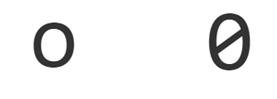
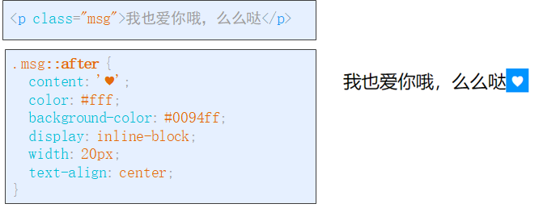
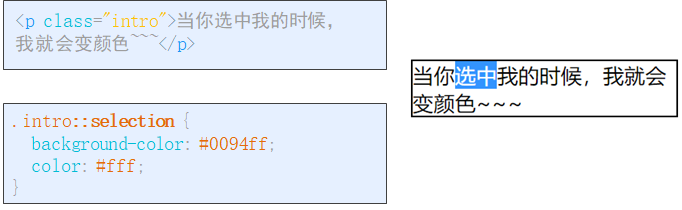
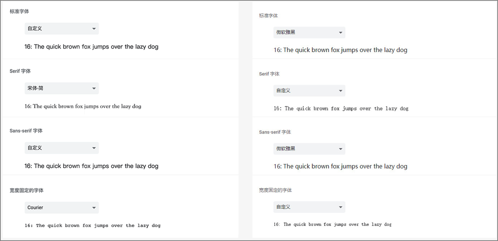
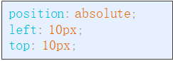
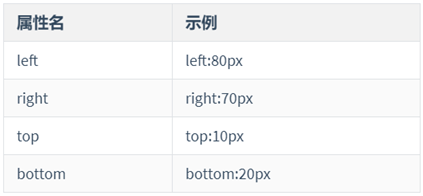
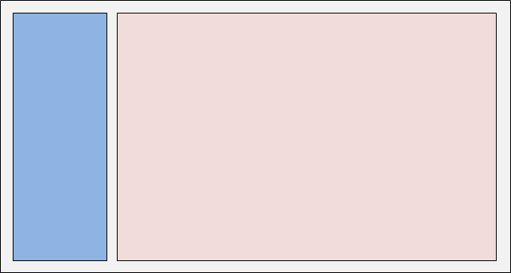

## 伪元素与元素定位

## 伪元素

**学习路径**

- before
- after
- selection
- placeholder

#### before

语法:

```css
元素::before
```

作用：

- 创建一个**伪元素**，放到匹配的标签元素**前面**

- 通过 content样式属性 来为**伪元素**添加修饰性的内容

  

  特点：

  - 伪元素默认为 行内元素

  - content 可以 设置图片
    - content: url(路径);

  - 伪元素选择器的语法标记是 :: ，但 : 也行(过时语法)

  - 伪元素由浏览器自动创建在目标元素内部

#### after

语法:

```css
元素::after
```

作用：

- 创建一个**伪元素**，放到匹配的标签元素**后面**

- 通过 content样式属性 来为**伪元素**添加修饰性的内容

- 伪元素默认为 行内元素



特点：

- 同before一致

#### selection

语法

```css
元素::selection
```

作用：

- 设置被选中的文本部分的样式

#### placeholder

语法

```css
input::placeholder
```

作用：

- 设置 input标签 中 placeholder属性值 的样式



## 元素定位

**学习路径**

- 静态定位
- 相对定位
- 绝对定位
- 固定定位
- 粘性定位
- 定位层叠

### **什么是元素定位？**

**所谓定位**

- 就是按照某种方式来**摆放**盒子

- 定位 = 定位类型 + 偏移量

基本语法:



定位类型:


偏移量



### 静态定位(了解)

作用：没有定位效果

语法:

```css
position: static;
```

特点：

- 静态定位按照标准流特性摆放位置，没有偏移量

- 用的比较少，因为默认就是它

### 相对定位(重点)

 作用：

- 元素相对于原来位置进行偏移，通过 top,right,bottom,left调整

语法：

```css
position: relative; 
top: 0x;
left: 0px;
```

特点：

- 是相对于原来位置，与父容器无关

- 相对定位不脱离文档流，位移后原来的位置仍被当前元素占有

- 如果把 4个偏移属性 同时使用，那么 left 和 top 生效

- 4个偏移属性的值 可以为负值（left:-10px;）

### 绝对定位(重点)

定义：

- 相对离自己**最近已定位的祖先元素**进行偏移

语法：

```css
position: absolute; 
top: 0x;
left: 0px;
```

特点：

- 相对于离自己最近**定位**祖元素的位置

- 所有祖元素都未定位时，参考浏览器窗口进行偏移

- 绝对定位会脱离文档流，原来位置不再占有

- 默认位置不变

注意:

**由于 *相对定位* 未脱离文档流，所以**绝对定位**通常配合 *相对定位* 使用**

### 固定定位(重点)

定义：相对于**浏览器窗口**进行偏移

语法：

```css
position: fixed;
top: 0x;
left: 0px;
```

特点：

- 会脱离文档流，位置移动后原来位置不再占有

- 默认位置为自身原来位置

- 如果同时设置相对方向的偏移量，则以 top 和 left 为准

### 粘性定位

定义：可以看成相对定位-relative和固定定位-fixed的结合

语法：

```css
position: sticky;
top: 0px;
```

特点：

- **需要设置 偏移量(top,bottom等) 才有效果**

- 偏移量可以是负值 top:-5px

- 以最近的具有滚动条的祖元素作为位移参考

- 不会脱离文档流，原位置不会被占据

### 定位层叠

问题：如果多个元素使用 定位时，位置重合了，那怎么调整层次呢？

解决：多个元素如果定位重合，可以通过 z-index 调整层次

语法：

```css
z-index: 数值;
```

特点：

- z-index 数值越大，层级越高，可以是负值

- z-index 只针对定位元素生效

- 默认情况，**书写顺序**靠后的层级高于靠前的

### 实际应用小技巧

#### 用于 对齐方式 微调

我们可以利用 定位将没有对齐的元素进行微调来对齐

情况一:

```html
<h3>1. 用于对齐方式的微调</h3>
<div class="input-item">
  <input type="checkbox"> <span>记住密码</span>
</div>
```

```css
body {
  padding: 0 40px;
  font-size: 14px;
}

.input-item{
  border: 1px solid #000;
}

.input-item input{
  /* 相对定位：相对于自己原来的位置 */
  position: relative;
  top: 2px;
}
```

情况二:

```html
<h3>2. 导航状态</h3>
<div class="navs">
  <a href="#">首页</a>
  <a href="#">新闻</a>
  <a href="#">杂志</a>
</div>
```

```css
/* 导航 */
.navs{
  border: 1px solid #000;
  width: 220px;
  height: 30px;
}

.navs a{
  text-decoration: none;
  color: #333;
  font-size: 18px;

  display: block;
  width: 70px;
  height: 29px;

  line-height: 29px;
  text-align: center;

  /* border: 1px solid #000; */

  /* 通过浮动来成行显示 */
  float: left;

  position: relative;
  bottom: -2px;
}

.navs a:hover{
  border-bottom: 2px solid red;
}
```

#### 跟随父盒子大小自适应宽高

问题: 如果子元素想根据父元素的宽高来自适应调整自己的宽高

方案：使用绝对定位，同时设置 left 和 right，top 和 bottom，可实现相对父元素的自适应布局。==一个重要的前提是不要为盒子指定 width 或 height==

```html
<h4>相对定位</h4>
<div class="box">
  <div class="inner"></div>
</div>
```

```css
body {
  padding: 0 10px;
}

.box {
  width: 300px;
  height: 200px;
  background-color: #0094ff;
  position: relative;
}

.inner{
  background-color: darkred;

  /* 绝对定位：相对于 最近的 有定位的 祖元素 */
  position: absolute;
  top: 40px;
  bottom: 40px;
  left:20px;
  right: 20px;
}
```

#### 经典布局: 两栏布局

效果图:



```html
<!-- 侧边栏 -->
<div class="aside"></div>

<!-- 内容区 -->
<div class="main"></div>
```

```css
body {
  margin: 0px;
  color: #333;
  line-height: 1.5em;
}
.aside {
  width: 180px; /* height: 100%; */
  background-color: #0094ff;
  border: 1px solid #000;
  /* 使用固定定位 让侧边栏靠左不动，会脱离标准文档流，所以 当前元素的高度 会以 窗口高度为参照 */
  position: fixed;
  left: 0px;
  top: 0px;
  bottom: 0px;
}
.main {
  margin-left: 200px;
}
```

## 虾米案例

#### 整体布局

- 外部大盒子 用来整体定位 ( 绝对定位 bottom 0 宽度100% 高度80px )

- 内部一个包装器 用来帮内部元素定位 ( 相对定位 宽高100% 内间距0 330 0 278)

- 左侧 控制区( 绝对定位 宽278 高100% left0 top0)

- 中间进度条( 绝对定位 宽100% 高20 字体大小10px top43)

- 右侧音量调节区( 绝对定位 高100% 宽330 right0 top0)

```html
<!-- 播放器 begin -->
<section class="player">
  <div class="controls_wrap">
    <!-- 按钮控制区 -->
    <div class="play_control">
    </div>

    <!-- 播放进度条和信息 -->
    <div class="play_info">
    </div>

    <!-- 声音控制 -->
    <div class="play_vol">
    </div>
  </div>
</section>
<!-- 播放器 end -->
```

```css
/* 播放器.包装器 */
.controls_wrap{
  position: relative;
  height: 100%;
  padding: 0px 330px 0 278px;
}

/* 播放器.按钮控制区*/
.play_control{
  position: absolute;
  width: 278px;
  height: 100%;
  left: 0;
  top: 0;
}

/* 播放器.进度条和信息 */
.play_info{
  height: 100%;
  position: relative;
}

/* 播放器.声音控制区 */
.play_vol{
  position: absolute;
  height: 100%;
  width: 330px;
  top: 0;
  right: 0;
}
```

#### 左侧按钮区域

```html
<!-- 按钮控制区 -->
<div class="play_control">
  <a href="#" class="prev"></a>
  <a href="#" class="play"></a>
  <a href="#" class="next"></a>
</div>
```

```css
.play_control a{
  display: block;
  width: 30px;
  height: 30px;
  position: absolute;
  top: 25px;
  background-image: url(../images/sprites.png);
}

.prev{
  left: 38px;
  background-position: 0 -90px;
}

.play{
  left: 91px;
  background-position: 0 -30px;
}

.next{
  left: 144px;
  background-position: 0 -60px;
}
```

#### 进度条和歌曲信息

```html
<!-- 播放进度条和信息 -->
<div class="play_info">
  <!-- 歌曲信息盒子 -->
  <div class="info">
    <a href="#">斑马，斑马</a> -
    <a href="#">宋冬野</a>
  </div>
  <!-- 进度条盒子 -->
  <div class="progress">
    <!-- 进度条 -->
    <div class="progress_bar">
      <span class="meter"></span>
    </div>
  </div>
</div> 
```

```css
/* 进度条和歌曲信息区域----------------- */
.play_info a{
  color: #fff;
}

.play_info .info{
  position: absolute;
  top: 20px;
  width: 100%;
  height: 18px;
  line-height: 18px;
  font-size: 14px;
}

.progress{
  position: absolute;
  top: 43px;

  width: 100%;
  height: 20px;

  font-size: 10px;
}

/* 进度条 */
.progress .progress_bar{
  position: absolute;
  left: 40px;
  right: 40px;

  height: 18px;
  background: url(../images/meter.png) center repeat-x;
}

/* 进度条.白色进度线 */
.meter{
  position: absolute;
  top: 8px;
  width: 60%;
  height: 2px;
  background-color: #fff;
}
```

#### 进度条完成

```html
<!-- 播放进度条和信息 -->
<div class="play_info">
  <!-- 歌曲信息盒子 -->
  <div class="info">
    <a href="#">斑马，斑马</a> -
    <a href="#">宋冬野</a>
  </div>
  <!-- 进度条盒子 -->
  <div class="progress">
    <!-- 进度条 -->
    <div class="progress_bar">
      <span class="meter"></span>
    </div>
  </div>
</div>
```

```css
/* 进度条.白色小圆点 */
.meter::after{
  content: '';
  position: absolute;
  right: -4px;
  width: 8px;
  height: 18px;
  margin-top: -8px;
  background: url(../images/sprites.png) -32px -338px no-repeat;
}
```

#### 时间区域

```html
<!-- 播放进度条和信息 -->
<div class="play_info">
  <!-- 歌曲信息盒子 -->
  <div class="info">
    <a href="#">斑马，斑马</a> -
    <a href="#">宋冬野</a>
  </div>
  <!-- 进度条盒子 -->
  <div class="progress">
    <!-- 进度条 -->
    <div class="progress_bar">
      <span class="meter"></span>
    </div>
    <!-- 两边的时间 -->
    <!-- 新增代码 -->
    <span class="current_time">00:00</span>
    <span class="end_time">05:30</span>
    <!-- 新增代码 -->
  </div>
</div>
```

```css
/* 进度条.时间区域 */
.progress > span{
  position: absolute;
  width: 40px;
  height: 18px;
  line-height: 18px;
  color: #fff;
  opacity: .3;
}

.progress .current_time{
  left: 0px;
  text-align: left;
}

.progress .end_time{
  right: 0px;
  text-align: right;
}
```

#### 音量控制

```html
<!-- 声音控制 -->
<div class="play_vol">
  <!-- 音量区 -->
  <div class="vol">
    <!-- 音量图标 -->
    <div class="vol_icon">
    </div>
    <div class="vol_meter">
      <span class="meter"></span>
    </div>
  </div>
</div>
```

```css
/* 声音控制区-------------------- */
.vol{
  position: absolute;
  top: 31px;
  right: 80px;
  width: 110px;
  height: 18px;

  border: 1px solid #fff;
}

/* 音量图标 */
.vol .vol_icon{
  position: absolute;
  left: 0;
  width: 18px;
  height: 18px;

  background: url(../images/sprites.png) 0 -295px;
}

.vol .vol_meter{
  position: absolute;
  left: 24px;
  width: 80px;
  height: 18px;
  background: url(../images/meter.png) center repeat-x;

}

/* 音量条 复用 了 进度条的样式，所以不需要重新写了 */
/* 仅仅单独为 音量条 进度 设置百分比 */
.vol_meter .meter{
  width: 20%;
}
```


