## 小兔鲜儿项目

### 网站制作流程

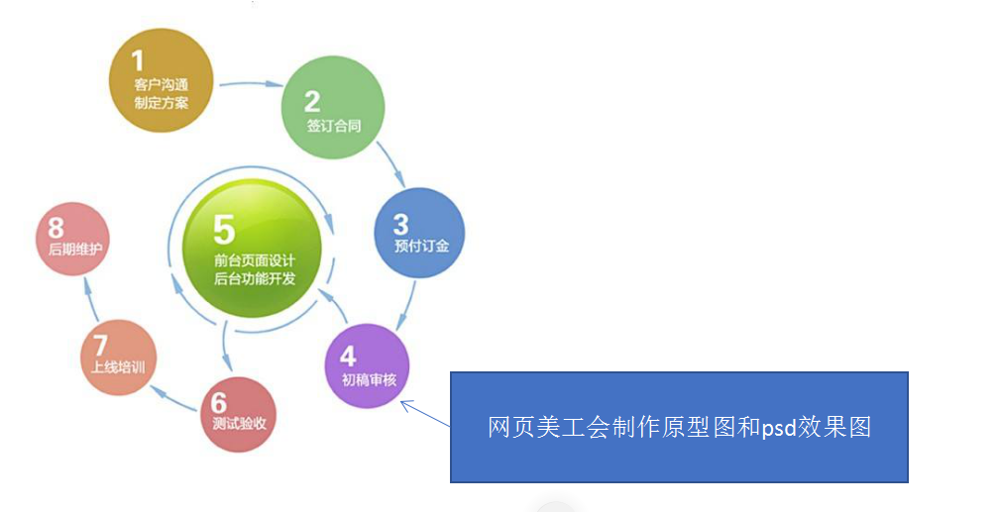

**原型图：** 页面的布局，告知我们开发人员，整个页面的结构是怎样的，说白了就是什么地方放什么内容

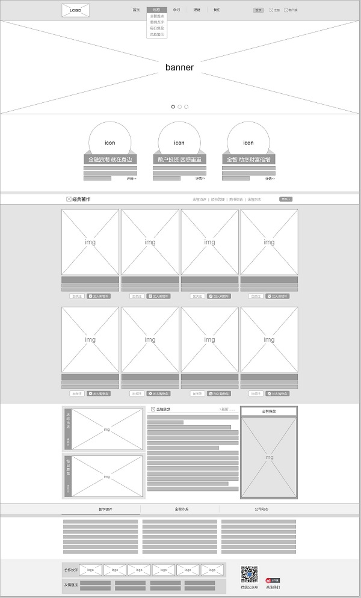

**效果图：**告知我们开发人员，最终做出来的成品应该是什么样子，相比原型图，效果图里面包含内容，风格，字体大小等等

### 项目规划

#### 项目介绍

- 项目名称：小兔鲜儿

项目介绍：电商发展十余年，是个成熟的商业模式

- 小兔鲜儿是B2C电商平台，综合品类平台

- 理念-(品质)新鲜、(价格)亲民、(物流)快捷

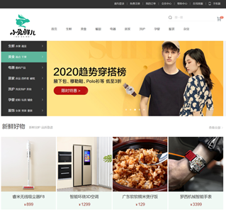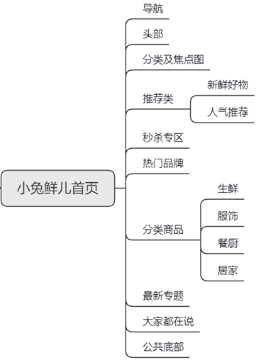

#### 学习目的

- 电商类网站比较综合，里面需要大量的布局技术，包括布局方式、常见效果以及周边技术

- 小兔鲜儿项目能复习、总结、提高基础班所学布局技术

- 写完项目，能对实际开发中**制作** **PC** **端页面流程**有一个整体的感知

- 为后期学习移动端项目做铺垫

#### 开发工具和技术栈

开发工具：

- VScode、摹客、主流浏览器(以 Chrome内核的浏览器为主)

技术栈：

- 利用 HTML5 + CSS3 手动布局

- 采取结构与样式相分离，模块化开发

- 良好代码规范有利于团队开发协作，提高代码质量，请遵循以下代码规范（详情见上课资料 **代码规范.md）**

### 项目搭建

- 文件夹结构

  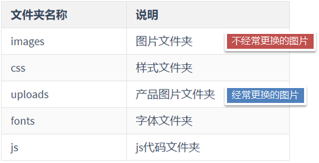

- 创建主要文件

  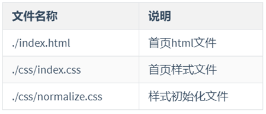

- 样式初始化文件 normalize.css 

#### normalize.css 文件

问题：

- 不同浏览器针对css规范中未定义的一些样式属性，产生不一样的效果

  比如：超链接访问过后的:hover伪类颜色

方案：

对默认样式进行统一设置（重置），达到所有浏览器对于未定义样式浏览效果尽量一致

1. 自己重置

2. 使用 normalize.css

    文件本身很小，但可以在 html样式上提供跨浏览器的高度一致性

用法：

1. 下载文件 

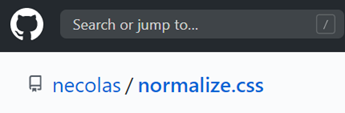

[normalize.css下载地址]: https://github.com/necolas/normalize.css


2. 在html页面中作为第一个引入的 normalize.css 即可,**把我们的样式写在后面可以覆盖它提供的样式**

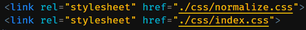

3. 缺点:

   1. 没有对常用的标签做 内外间距重置

   2. 解决方案

      1. 通配符选择器：

         ```css
         * { margin: 0;  padding: 0;  }
         ```

      2. 使用**具体的标签选择器**：

         ```css
         /* 新浪网设置方式：*/
         html,body,ul,li,ol,dl,dd,dt,p,h1,h2,h3,h4,h5,h6,form,fieldset,legend,img{ 
           margin:0; 
           padding:0;
         }
         ```

#### **favicon** 网站图标

favicon.ico 是一个缩略图标，显示在标签栏

特点：

- 在标签栏增加识别度

- 图片文件很小

步骤：

- 制作 favicon 图标

  - 制作 图标图片（准备图片 jpg / png...）

  - 转换为 ico 图标（通过第三方网站：比特虫 bitbug.net)

    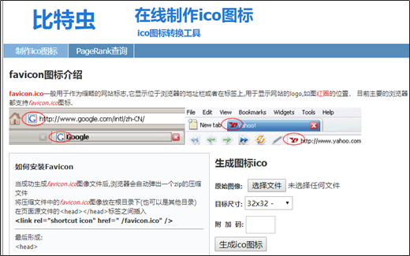

- 将图标放到网站根目录

  

- html 页面引入 图标
  - -在<head> </head> 之间引入代码：
  - 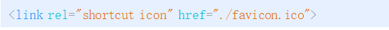

### 摹客网的使用

地址: www.mockplus.cn 

#### 步骤

- 注册 和 登录

- 进入 “我的项目”

- "我的摹客" -> 选择团队 并 查看

- 在 项目管理界面中，选择 要查看的项目

- 在 页面管理界面中，可以看到所有页面ps图

- 双击 ps 图，就可以查看完整图例和尺寸了

#### 图例尺寸**查看技巧**

- 点击选中图片A，会显示它的 尺寸

- 同时鼠标移动到图片外面，会显示图片A与周边图片距离

- 鼠标移动到图片B上，会显示图片A和图片B的间距

### 首页制作

- 编写公共样式

- 按照由上到下顺序编写页面模块

- 所有数据参照 摹客网提供尺寸

#### **顶部导航区**

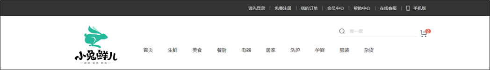

- 顶部导航，就是通常所说的快捷导航(div)

- 内部包含版心(div)，统一宽度 和 自动居中

- 版心里包含一个菜单列表(ul)

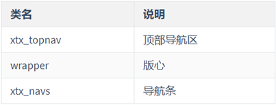

```html
<!-- 顶部导航区 -->
<div class="xtx_topnav">
  <!-- 版心 -->
  <div class="wrapper">
    <!-- 导航条 -->
    <ul class="xtx_navs">
      <li>
        <a href="#">请先登录</a>
      </li>
      <li>
        <a href="#">免费注册</a>
      </li>
      <li>
        <a href="#">我 的订单</a>
      </li>
      <li>
        <a href="#">会员中心</a>
      </li>
      <li>
        <a href="#">帮助中心</a>
      </li>
      <li>
        <a href="#">在线客服</a>
      </li>
      <li>
        <a href="#">
          手机版
        </a>
      </li>
    </ul>
  </div>
</div>
```

```css
/* 页面公共样式 -------------------*/
div,ul,li,h1,h2,h3,p,dl,dd {
  /* 设置盒子宽高 包含 padding 和 border */
  box-sizing: border-box;
}

a {
  text-decoration: none;
  color: #333;
}
/* 背景设置为精灵图 */
.sprites {
  background-image: url(../images/sprites.png);
  background-size: 400px 400px;
  background-repeat: no-repeat;
}

/* 版心 */
.wrapper {
  width: 1240px;
  margin: 0 auto;
}

/* 顶部导航区 ------------------------*/
.xtx_topnav {
  height: 43px;
  background-color: #333;
}

/* 导航条(菜单) */
.xtx_topnav .xtx_navs {
  border: 1px solid blue;
  line-height: 43px;
  height: 43px;
  text-align: right;
  font-size: 0;
}

.xtx_topnav .xtx_navs li {
  display: inline-block;
  font-size: 14px;
}

.xtx_topnav .xtx_navs li a {
  color: #dcdcdc;
  border-right: 2px solid #666;
  padding: 0 13px;

  display: inline-block;
  line-height: 1;
}

.xtx_topnav .xtx_navs li a:hover {
  color: #27b99a;
}

.xtx_topnav .xtx_navs li:last-child a {
  border: 0px;
}

/* 设置导航中的 手机背景图 来一起试一试 */
.mobile {
  display: inline-block;
  width: 20px;
  height: 16px;
  /* border: 1px solid #fff; */
  background-position: -160px -70px;
  position: relative;
  top: 3px;
}
```

#### box-sizing属性设置

作用：设置盒子宽高的计算方式

语法：

```css
box-sizing: content-box(默认) 盒子宽高不包含内边距和边框
box-sizing: border-box 盒子宽高包含内边距和边框
```

#### 头部区域制作

#### logo制作

- 使用 h系列标签对SEO搜索引擎友好
- 内容插入超链接,点击后返回首页
- 链接内容写文字,增加自然排名
- 文字隐藏

```html
<!-- 头部区域 -->
<div class="xtx_header">
  <div class="wrapper">
    <!-- 头部.logo -->
    <h1 class="xtx_logo">
      <a href="#" title="小兔鲜儿">小兔鲜儿</a>
    </h1>      
    <!-- 头部.搜索区 -->
    <div class="xtx_search"></div>        
    <!-- 导航区 -->
    <ul class="xtx_navs"></ul>
  </div>  
</div>
```

```css
/* 头部区 ------------------------*/
.xtx_header {
  height: 183px;
  padding: 32px 0 20px;

  border: 1px solid #000;
}

/* 头部区.logo */
.xtx_logo {
  width: 143px;
  height: 129px;
  margin-left: 50px;
  background-image: url(../images/logo.png);
  background-size: contain;
  float: left;
  /* border: 1px solid #000; */
}

.xtx_logo a {
  display: block;
  height: 100%;
  text-indent: -999px;
  /* font-size: 0; */
  /* border: 1px solid #000; */
}
```


#### 搜索区制作

```html
<!-- 头部.搜索区 -->
<div class="xtx_search">
  <!-- 购物车按钮 -->
  <a href="#" class="xtx_search_car sprites">
    <i>2</i>
  </a>
  <!-- 输入区 -->
  <div class="xtx_search_wrapper">
    <input type="text" placeholder="搜一搜" />
  </div>
</div>
```

```css
/* 头部.搜索区 */
.xtx_search {
  height: 38px;
  margin-left: 920px;
}

/* 头部.搜索区.输入区 */
.xtx_search_wrapper {
  width: 264px;
  height: 38px;
  padding-left: 39px;
  border-bottom: 1px solid #e7e7e7;

  /* 设置为 相对定位，但不修改位置，从而保留在原地不动 。
     目的：是为了让放大镜图标进行绝对定位时，有参考位置
  */
  position: relative;
}

/* 头部.搜索区.输入区.文本框 */
.xtx_search_wrapper input {
  width: 190px;
  height: 90%;
  font-size: 15px;
  color: #999;
  border: 0px;
}

/* 头部.搜索区.输入区.伪元素(放大镜图片) */
.xtx_search_wrapper::before {
  content: '';
  display: block;
  width: 17px;
  height: 17px;

  background-image: url(../images/sprites.png);
  background-size: 400px 400px;
  background-position: -80px -70px;

  position: absolute;
  left: 5px;
  top: 10px;
}

/* 头部.搜索区.购物车按钮 */
.xtx_search .xtx_search_car {
  display: block;
  width: 22px;
  height: 22px;

  float: right;
  margin: 8px 12px 0 12px;

  background-position: -120px -70px;

  position: relative;
}

.xtx_search .xtx_search_car i {
  position: absolute;
  top: -5px;
  left: 16px;

  padding: 1px 6px;
  font-size: 13px;
  background-color: #ea745e;
  color: #fff;

  border-radius: 40%;
  font-style: normal;
}
```


#### 导航区制作

```html
<!-- 导航区 -->
<ul class="xtx_navs">
  <li>
    <a href="#" class="active">首页</a>
  </li>
  <li>
    <a href="#">生鲜</a>
  </li>
  <li>
    <a href="#">美食</a>
  </li>
  <li>
    <a href="#">餐厨</a>
  </li>
  <li>
    <a href="#">电器</a>
  </li>
  <li>
    <a href="#">居家</a>
  </li>
  <li>
    <a href="#">洗护</a>
  </li>
  <li>
    <a href="#">孕婴</a>
  </li>
  <li>
    <a href="#">服装</a>
  </li>
  <li>
    <a href="#">杂货</a>
  </li>
</ul>
```

```css
/* 头部搜索区.导航列表 */
.xtx_header .xtx_navs {
  padding-top: 37px;
  margin-left: 280px;
  list-style-type: none;
}

.xtx_header .xtx_navs li {
  float: left;
  line-height: 1;
  font-size: 16px;
  margin-right: 50px;
}

.xtx_header .xtx_navs li a:hover,
.xtx_header .xtx_navs li a.active {
  color: #5eb69c;
  padding-bottom: 3px;
  border-bottom: 2px solid #5eb69c;
}
```

