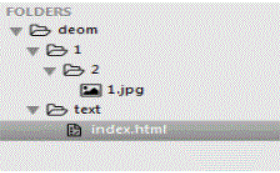
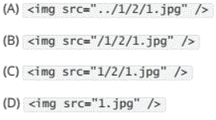
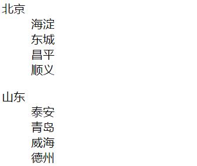
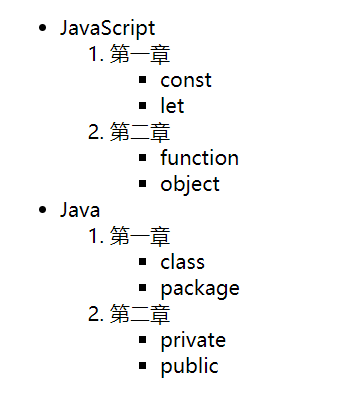
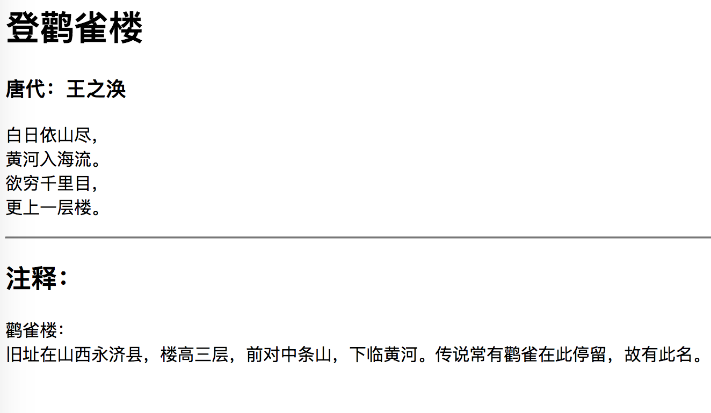
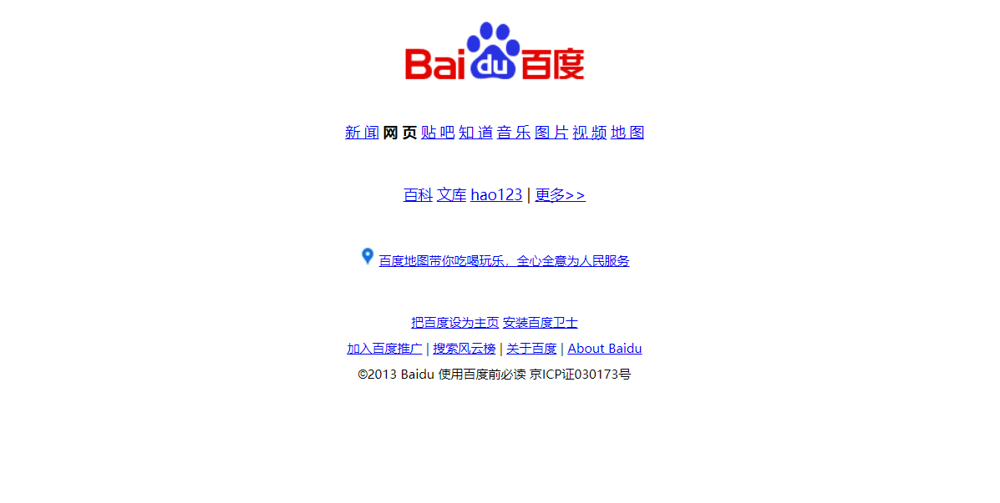
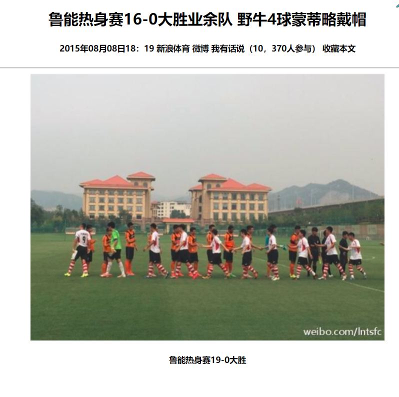

# HTML5-测试题

#### 选择题

##### 1. 下列关于 HTML 描述错误的是（B）

- [ ] HTML 就是 Hyper Text Markup Language 翻译成中文就是超文本标记语言

- [ ] HTML 的扩展名只能是\*.html
- [ ] HTML 由多个标签组成
- [ ] 我们能看到的网页源代码都是 HTML 组成

##### 2. 下面哪个是单标签（D）

- [ ] head 标签

- [ ] body 标签
- [ ] title 标签
- [ ] br 标签

##### 3. 关于标签下列说法正确的是 ( B )

- [ ] P1 是段落标签

- [ ] H1 是标题标签
- [ ] Hr 是换行标签
- [ ] Br 是一条直线

##### 4. 下列哪项设置可以让鼠标移入图片时，可以显示图片的文字描述（B ）

- [ ] 设置 alt 属性

- [ ] 设置 title 属性
- [ ] 设置 href 属性
- [ ] 设置 src 属性

##### 5. 下列关于图片标签描述错误的是（C）

- [ ] 图片标签是用来显示图片的

- [ ] 图片标签常见的形式\
- [ ] 图片标签的属性有 alt 图片不显示时显示的文字，title 图片的标题
- [ ] height 和 width 可以设置图片的宽高

##### 6. 下列关于路径的说话错误的是（D）

- [ ] 路径分为绝对路径和相对路径

- [ ] 路径就是一个文件存放的位置
- [ ] 绝对路径就是目录下的绝对位置，一般是盘符的开始位置；相对路径就是当前文件与其他文件之间的相对关系。
- [ ] ../是上一级目录，../../是上上级目录，都是绝对路径

##### 7. 关于标签下列说法不正确的是(B)

- [ ] H 标签有 6 个等级分别是\<h1>\<h2> \<h3> \<h4>\<h5>和\<h6>

- [ ] h1 到 h6 文字从小到大
- [ ] p 标签一行只能放一个
- [ ] p 是段落标签会给文字加上段落的语义

##### 8. 下列关于 HTML 的超链接形式正确的是（B）

- [ ] \<a name=" http://www.czxy.com/">传智主页</a>

- [ ] \<a href=" http://www.czxy.com/">传智主页</a>
- [ ] \<a> http://www.czxy.com/\</a>
- [ ] \<a url=" http://www.czxy.com/">传智主页</a>

##### 9. 关于列表描述的错误的是(C)

- [ ] 列表分为有序列表和无序列表，自定义列表

- [ ] 有序列表默认能自动添加序号
- [ ] 自定义列表由 dt，dl 组成
- [ ] \<ol>标签是有序列表，\<ul>标签是无序列表

##### 10. 下面结构中，哪种写法可以在 index 页面中输出 1.jpg ( B )





#### 简答题

##### 1. 标题标签有哪些，有什么特点?

```js

```

##### 2. 怎么引入图片，图片有哪些属性，并解释属性的作用？

```js

```

##### 3. 绝对路径和相对路径怎么区分？

```js

```

##### 4. HTML 中的列表有哪几种？语法分别是什么？

```js

```

##### 5. 表示音频和视频的标签分别是什么？举出 3 个两个标签上面共有的属性，并且解释作用?

```js

```

#### 编程题

##### 1. 完成下面效果图的制作



##### 2. 完成下面效果图的制作




##### 3. 完成下面效果图的制作



##### 4. 完成下面效果图的制作



##### 5. 完成下面效果图的制作


