# HTML第一天

### 网页开发相关概念:

- 网站和网页的关系
- 什么是网页?

### 网站和网页的关系

- 包含关系：网站 是由若干网页资源组成的集合

### 什么是网页：

- 使用HTML语法编写的html文件，文件后缀是.html或者.htm
- 内容包含文字、链接、音频、视频等
- 使用浏览器打开查看

### 总结:

- 网页 就是 一个 后缀名为 .html 的 文件，由浏览器负责解析生成图形界面


## HTML简介

- 超文本标记语言，标记是由标签构成，如<html>
- 用来描述网页的内容

### 超文本是什么意思？

- 可以表示文本之外，还能表示图片、声音、视频等内容（超越了文本的范畴）
- 可以从一个文件跳转到另一个文件(超链接文本)
- 可以查看音频，视频等

### 网页的形成:

- 浏览器会负责将普通用户看不懂的HTML代码解析成图形界面,方便普通用户查看
- 左侧是普通用户查看，右侧是浏览器解析HTML代码(目前关注HTML)

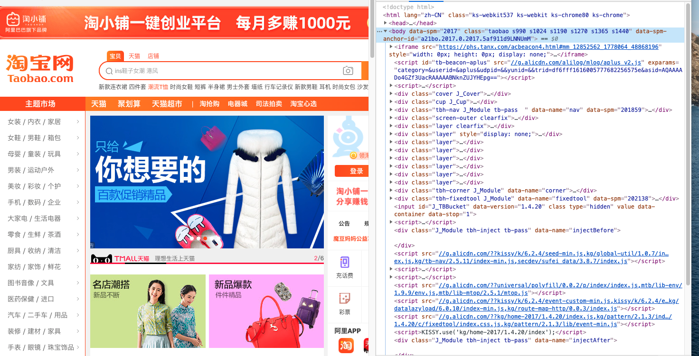

### HTML语法规范:

- HTML 是一种超文本标记语言，由固定的 HTML标签 组成

#### HTML标签 分两种：

- 单标签：有些特殊的标签必须是单个出现，如
- 双标签：标签成对出现，如<html></html>>

#### 标签有两种关系:

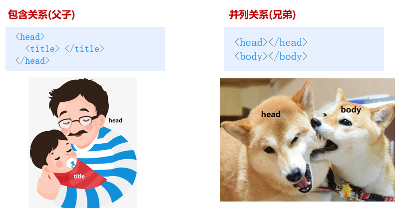

### HTML基本结构

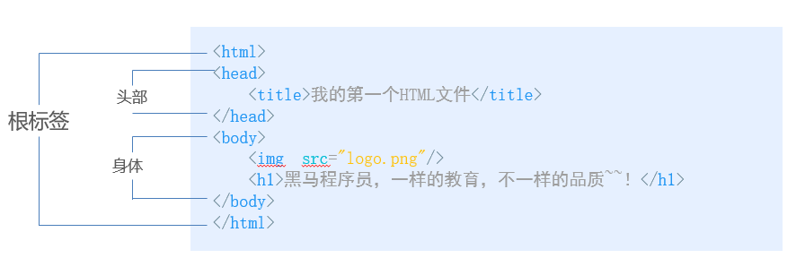

- 每个网页都会有一个基本的结构标签
- html语言是标签语言，使用<> 标记写法
- html基本结构
  - html标签：根标签，所有内容都需要写在根标签内
  - head标签：页面头部，包含网页关键信息
  - title标签：页面的标题
  - body标签：页面的主体，包含页面给用户看到的主要内容

## 开发环境介绍

- 介绍与安装 vscode
- 安装 vscode 常用插件
- 设置 vscode
- 介绍与安装浏览器

### vscode安装

- 下载地址:  https://code.visualstudio.com/Download

  注意小伙伴们: 推荐大家安装时勾选一下内容

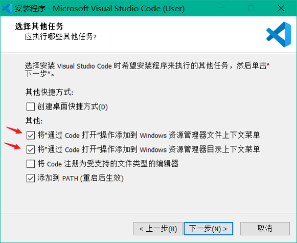

他们的作用是:

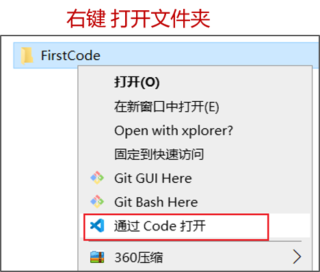

### vscode插件安装

- Chinese 汉化包
- Dark+ Material 皮肤
- Prettier Code formatter 格式化代码插件
- open in browser 快速在浏览器打开网页
- Auto Rename Tag  自动重命名 HTML结束标签

### vscode设置

- 新建文件： (ctrl + n)
- 保存： (ctrl + s) ，注意网页文件后缀为 .html
- 放大缩小代码字体： (ctrl + 加号键 或 减号键)
- 快速生成 整个html 页面：(！+ tab键) 

### 浏览器：

- 常用的浏览器

  1. IE
  2. 火狐
  3. 谷歌
  4. 苹果
  5. 欧朋

-  浏览器是网页显示、运行的平台。常用的浏览器有 IE、火狐（Firefox）、谷歌（Chrome）、Safari和Opera等。平时称为五大浏览器。
-  查看浏览器市场份额：https://tongji.baidu.com/research/site
  
  浏览器内核（渲染引擎）
+  负责读取网页内容，整理讯息，计算网页的显示方式并显示页面
  
+  目前国内一般浏览器都会采用 Webkit/Blink 内核，如 360、UC、QQ、搜狗等。

  

## HTML常用标签：

- 标题标签
- 注释标签
- 段落与换行标签
- 列表标签
- 图片标签与相对路径(重点)
- 音频与视频标签
- 超链接标签

### 标题标签

- HTML 提供了 6个等级的标题，代表不同的重要程度
- 场景：在新闻或文章页面中，都离不开 标题

语法：HTML 提供了 6个等级的标题，代表不同的重要程度

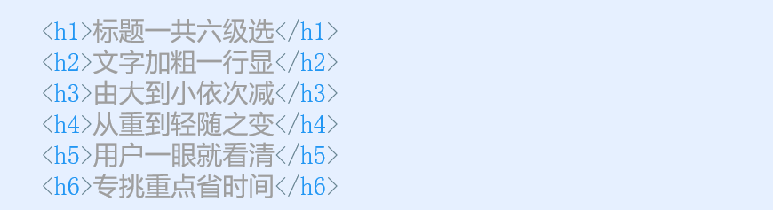

- 语义：作为标题使用，重要程度从 1到6 依次递减

- 特点：
  1.每个标题独占一行
  2.标题的文字 加粗，字号 加大


### 注释:

- 场景：在代码中留下给开发者看的说明文字

  1.给其他开发者看

  2.给以后的自己看

语法：快捷键：ctrl + /

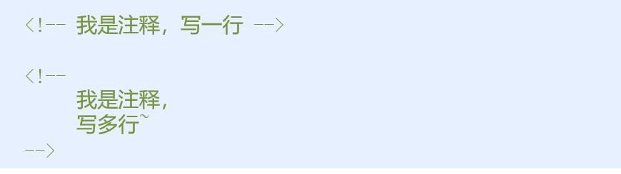

特点:

​    1.注释标签中的内容 只能在源码中看到

2. 浏览器会忽略注释标签中的内容，不会显示给用户看

### 段落与换行标签 

段落场景：文章内容需要分段显示


语法：

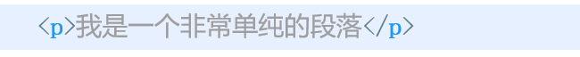


```javascript
段落语义：可以把网页分为若干个段落

特点

1.前后换行，段落间自动空行
2.浏览器宽度不够时自动换行
```


#### 换行

```javascript
场景：
	如果希望某段文字强制换行显示，就可以使用换行标签
```

语法：

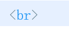

```javascript
换行标签语义：强制换行

特点：

1.是单标签
2.换行，不空行
```

### 列表(重点)

```javascript
列表场景：
	列表标签主要用来自由布局显示数据
    
列表特点：
    整齐、有序，作为布局时很方便且自由

三种列表：
    1.无序列表
    2.有序列表
    3.自定义列表


```

#### 无序列表

```javascript
应用场景：
    用来展示无序号列表，每项前一般有个项目符号
```

语法：

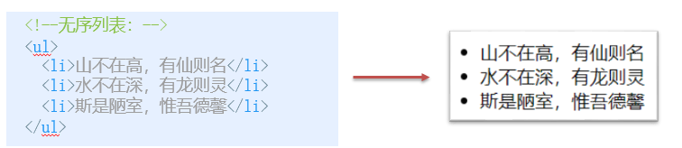

```javascript
注意
1. <ul></ul> ：
     无序列表标签，内部 只能 嵌套 <li></li>```
2.<li> </li>：
     列表项标签，内部可以放任意标签和内容
3.无序列表中的 列表项 之间，没有顺序和级别之分，是并列关系
4.无序列表也有一些样式属性，实际开发时，一般用css来设置
```

#### 有序列表

```javascript
场景：用来展示有序号列表，每个列表项前都有一个序号
```

语法：

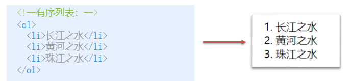

```javascript
注意：

1. <ol></ol> ：
   有序列表标签，内部 只能 嵌套 <li></li>
2. <li> </li> ：
   列表项标签，内部可以放任意标签和内容
3. 有序列表也有一些样式属性，实际开发时，一般用css来设置

总结:
1.布局和无顺序数据时，用无序列表
2.要显示有顺序的数据时，才偶尔用有序列表
```


#### 自定义列表

场景：常用于对术语或名词进行解释和描述，定义列表的列表项前没有任何项目符号

语法：

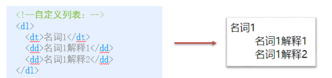

注意：

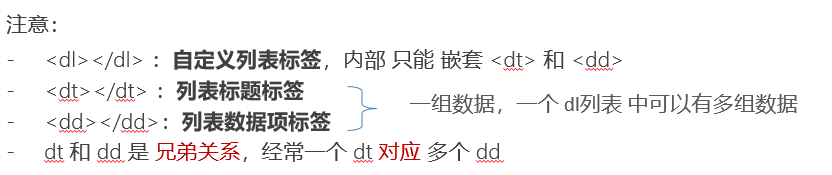

#### 列表总结

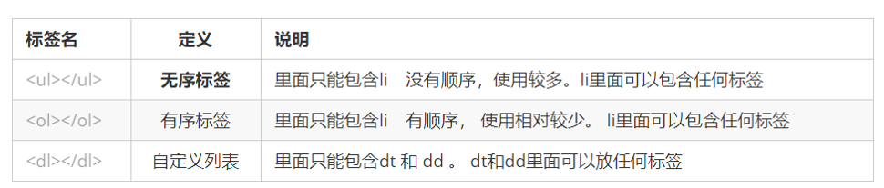

### 图像标签与相对路径

#### 图像

```javascript
场景：在网页中插入 指定路径的图片
```

语法：

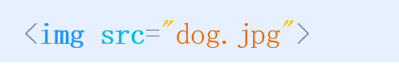

注意：

```javascript
1.src 属性 用来指定 要显示图片的路径名称
2.标签的属性：就是属于这个标签的相关信息，供浏览器使用
3.图片只设置 宽度 或 高度，浏览器会自动 对另一个进行 等比缩放
4.图片标签可以拥有多个属性，属性必须书写在标签名后面
5.属性之间不分先后顺序
6.属性之间用 空格 分隔
```

图片格式：

```javascript
图片的格式
        1.jpg(jpeg)：
             1. 支持的颜色比较丰富，不支持透明效果, 不支持动图
             2. 一般用来显示照片

        2.png
            1. 支持的颜色比较丰富，支持复杂透明效果, 不支持动图
            2. 专为网页而生 
            
        3.gif
            1. 支持的颜色比较少,支持简单透明,支持动图
            2. 颜色单一的图片,动图
        
        4.webp
            1.google新推出,采用图像数据压缩，图片质量有保障前提下,使图片体积更小

    
        5.base64编码
            1.减少http请求
            2.提前加载图片
```


#### 相对路径介绍(重点) 

```javascript
问题：开发时，项目中的各种文件很多，如果都存在一个文件夹中，会不方便管理和查找
```

解决方案：所以会用文件夹分类存放

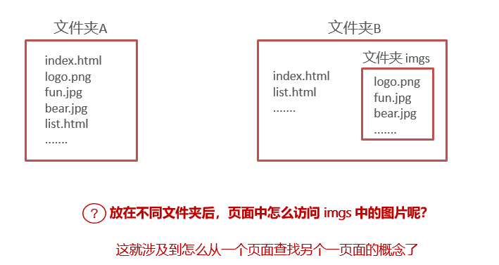

相对路径：是指 从一个文件 到 另一个文件的位置( 比如：html页面 到 图片的位置 )

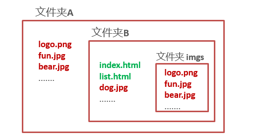

#### 相对路径的三种分类

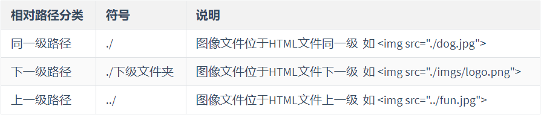

### 音频标签

场景：在网页中插入 音频文件播放

语法：

​	 基本语法

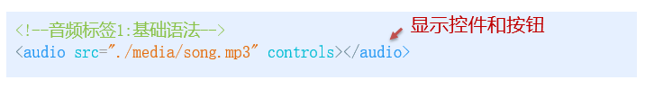

​	 兼容语法

​	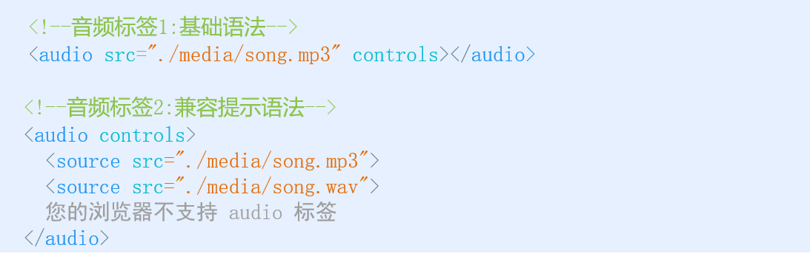

浏览器支持格式:

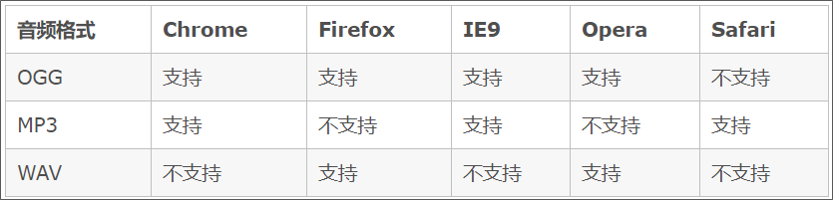

属性：

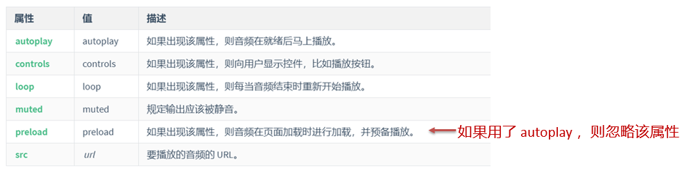

注意：

- 大部分情况下：使用 基础语法 即可

- 极少数情况下：需要兼容语法，主要是因为 有些浏览器对音频格式的支持不一样  老式浏览器 不支持 audio 标签，就会显示 提示文字


### 视频标签

场景：在网页中插入 视频文件播放

语法：

 -  基本语法	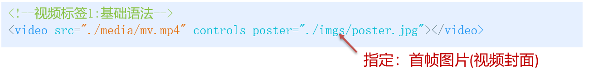

 -  兼容语法

    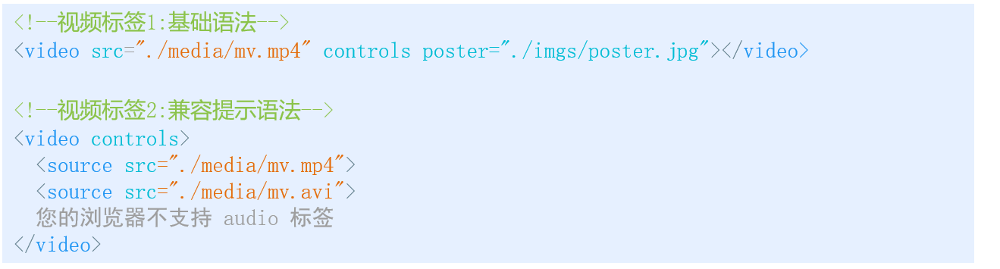

浏览器支持情况:

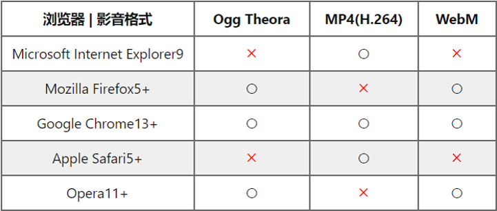

属性：

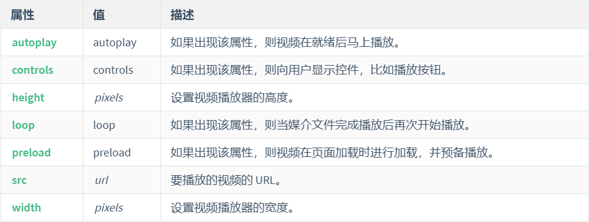

注意：

- 大部分情况下：使用 基础语法 即可

- 极少数情况下：兼容提示语法，主要是因为 有些浏览器对视频格式的支持不一样   老式浏览器 不支持 video 标签，就会显示 提示文字

### 链接标签：

作用：从 位置A 跳到 位置B 的 传送门

语法：

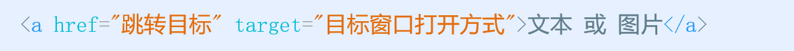

属性:

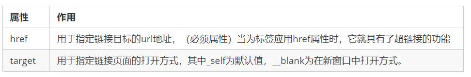

```javascript
场景分类：

1.跨页面：从 同一个网站的 A页面 跳到 B页面

2.跨网站：从 网站A的页面 跳到 网站B的页面

3.跨位置：从 同一个页面的 A位置 跳到 B位置 (后面再讲)
```

实现点击下载:

原理: 当浏览器 遇到 它无法直接打开的文件时，就会提示用户下载

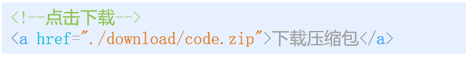  

空链接: 如果想写一个不跳转页面的 超链接，可以使用 # 号

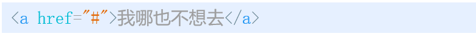

实现拨打电话: 如果在手机端点击时，就会拨打电话

```javascript
<a href="tel:+12345">12345</a>
```

发送邮件

```javascript
 <a href="mailto:waqa8t@163.com">点击联系我们</a>
```

锚点:当前页面点击时，页面滚动到当前页面指定位置

```javascript
<a href="#自定义名字">去访问段落</a>
```

### 符号实体

场景：一些特殊的符号很难或者不方便直接使用，可以使用下面的字符来替代语法:


重点记住：空格 、大于号、 小于号 这三个， 其余的使用很少，需要时再查阅

