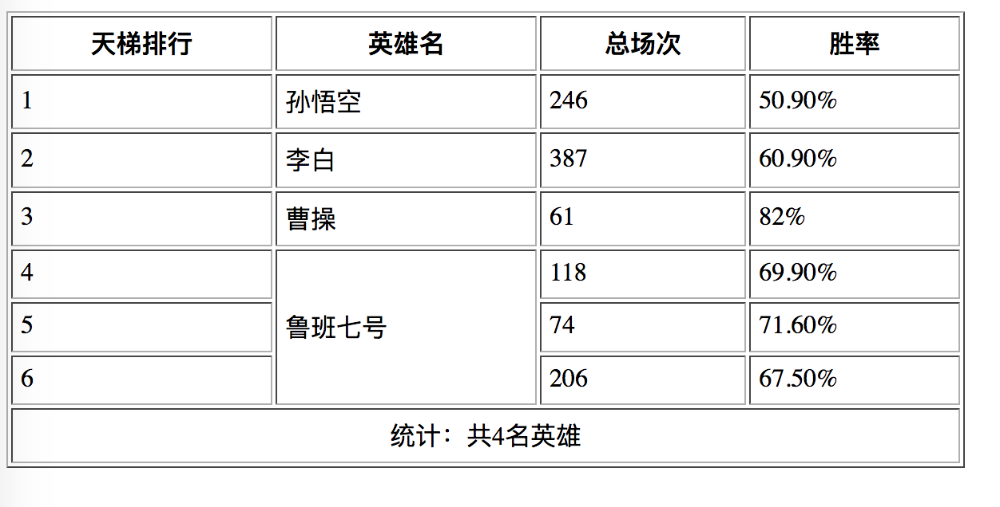
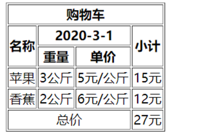
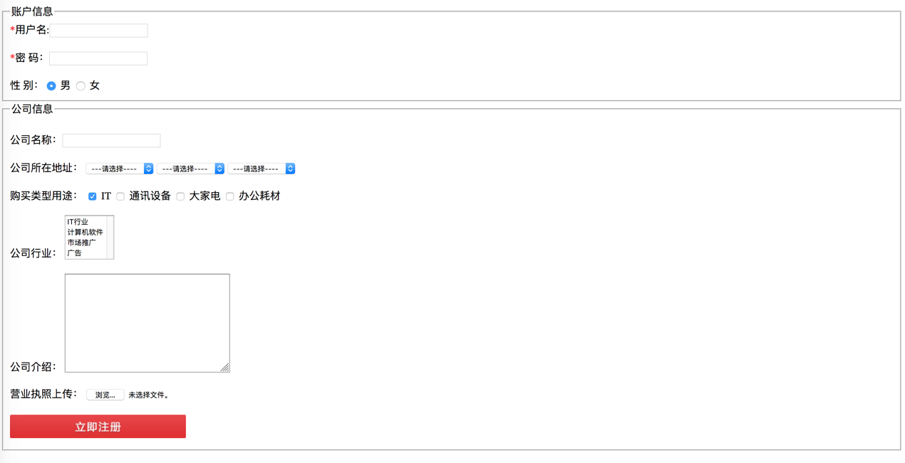
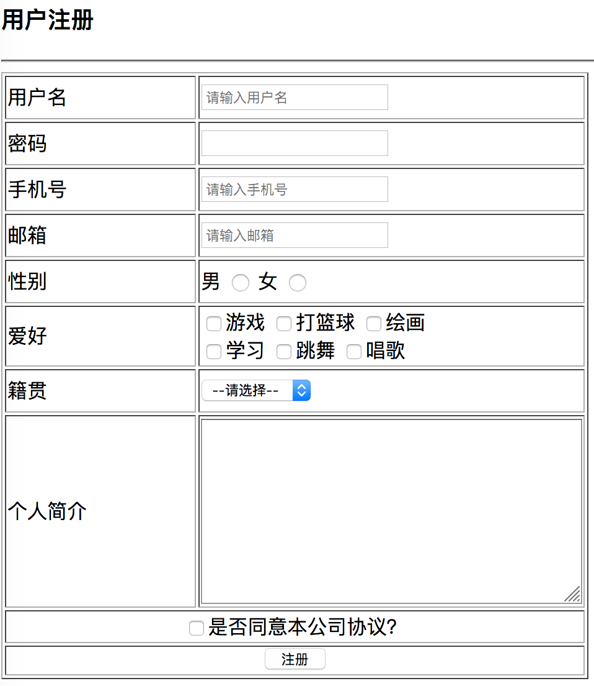
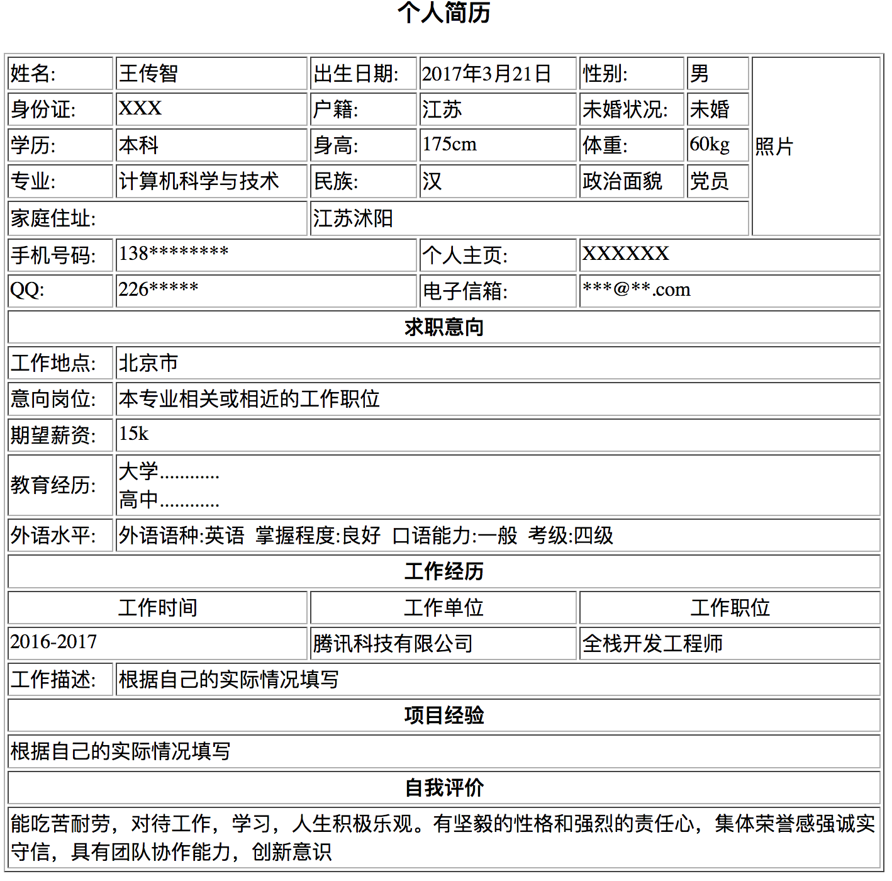

# HTML5-测试题

#### 选择题

##### 1. HTML中，设置表格中文字和边框距离的属性是(C)

- [ ] A、\<table border=#>


- [ ] B、\<table cellspacing=#>


- [ ] C、\<table cellpadding=#>


- [ ] D、\<table width=#>

##### 2. 以下标记中，用于定义一个单元格的是(A)

- [ ] A、\<td>\</td>


- [ ] B、\<tr>\</tr>


- [ ] C、\<table>\<table>


- [ ] D、\<caption>\</caption>

##### 3. 下列关于表格描述错误的是(C)

- [ ] A、表格由行和列组成


- [ ] B、表格由头和主体组成


- [ ] C、rowspan属于跨列合并，使用colspan属性跨行合并


- [ ] D、通过表格的属性我们可以更改表格的样式，宽高等

##### 4. 下列关于select说法错误的是(C)

- [ ] A、select是下拉列表菜单


- [ ] B、option为下拉列表数据标签


- [ ] C、select主要作用是制作多选框
- [ ] D、select可以默认选择"selected = selected"

##### 5. 关于表格恩等描述正确的一项是(D)

- [ ] A、在单元格内不能继续插入整个表格


- [ ] B、可以同时选定不相邻的单元格


- [ ] C、粘贴表格时，不粘贴表格的内容


- [ ] D、在网页中，水平方向可以并排多个独立的表格

##### 6. 下列HTML标签中，用于创建一个复选框的表单元素是（C）

- [ ] A、＜input type="radio"＞


- [ ] B、＜input type="submit"＞


- [ ] C、＜input type="checkbox"＞


- [ ] D、＜input type="reset"＞

##### 7. 下列哪个不是input标签的type属性类型?（C）

- [ ] A、text


- [ ] B、password


- [ ] C、textarea


- [ ] D、button

##### 8. 要在表单中创建一个多行输入文本框，初始值：这是一个多行文本框，下面语句正确

的是（D）

- [ ] A、\<textarea name="text1" value="这是一个多行文本框">\</textarea> 


- [ ] B、\<input type="text" value="这是一个多行文本框" name="text1"> 


- [ ] C、\<input type="textarea" name="text1" value="这是一个多行文本框" > 


- [ ] D、\<textarea name="text1" cols=20 rows=5>这是一个多行文本框\</textarea>

##### 9. 在表单中包含性别选项，且默认状态为“男”被选中，下列正确的是（C）

- [ ] A、＜input type=checkbox name=sex enabled＞ 男


- [ ] B、＜input type=checkbox name=sex checked＞ 男


- [ ] C、＜input type=radio name=sex checked＞男


- [ ] D、＜input type=radio name=sex enabled＞男

##### 10. 阅读代码，然后选择一项符合要求的说明（A）

\<input type="text" name="myName">  

\<input type="radio" name="mySex">  

\<input type="checkbox" name="myFav">  

\<input type="password" name="myImg">  

- [ ] A、上面代码的表单元素类型分别是：文本框、单选按钮、复选框、密码框


- [ ] B、上面代码的表单元素类型分别是：文本框、复选框、单选按钮、密码框


- [ ] C、上面代码的表单元素类型分别是：密码框、多选按钮、复选框、密码框


- [ ] D、上面代码的表单元素类型分别是：文本框、单选按钮、下拉列表框、密码框

#### 简答题

##### 1. 请列举网页中的元数据中的常见属性，并解释属性的作用?

```js

```

##### 2. 请写出表格的结构，并且举出一些表格常见的属性，并解释属性的作用?

```js

```

##### 3. 请列举不少于6个常见的表单，写完整的结构，并且解释表单的类型？

```js

```

##### 4. 请列举不少于5个表单常见的属性，并解释属性的作用?

```js

```

##### 5. 请写出表格怎么进行合并？

```js

```

#### 编程题

##### 1. 完成下面效果图的制作



##### 2. 完成下面效果图的制作




##### 3. 完成下面效果图的制作



##### 4. 完成下面效果图的制作




##### 5. 完成下面效果图的制作


