# HTML第二天

- 文档声明
- 元数据及作用
- 文档编码
- 表格标签
- 表单标签
- 查阅文档

## DOCTYPE

HTML版本:

- HTML 1.0——在1993年6月作为互联网工程工作小组（IETF）工作草案发布（并非标准）；
- HTML 2.0——1995年11月作为RFC 1866发布，在RFC 2854于2000年6月发布之后被宣布已经过时 ；
- HTML 3.2——1996年1月14日，W3C推荐标准 ；  HTML 4.0——1997年12月18日，W3C推荐标准 ；
- HTML 4.01——1999年12月24日，是在HTML4.0基础上的微小改进，W3C推荐标准；
- HTML 5 的第一份正式草案已于2008年1月22日公布,仍继续完善；

**```<!DOCTYPE>```文档类型声明，告诉浏览器 使用哪种 HTML版本 来显示网页**

语法：

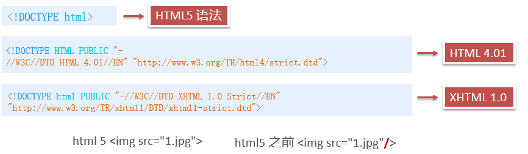

注意：

- ```<!DOCTYPE>``` 放在页面的 **第一行**

- ```<!DOCTYPE> ```本身不是 HTML标签，而是 文档类型 的声明标签

## 元数据及作用

**元数据标签 ：**描述网页相关信息的数据，如网页编码、关键字、描述信息等

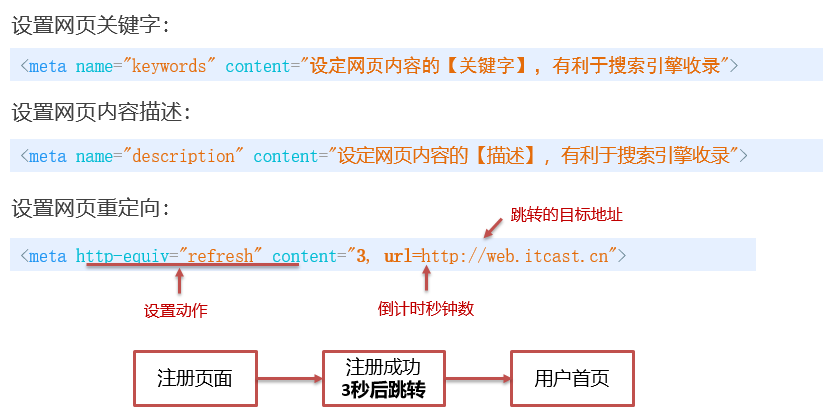

## lang 语言种类

作用：标识 文字内容 所使用的语言

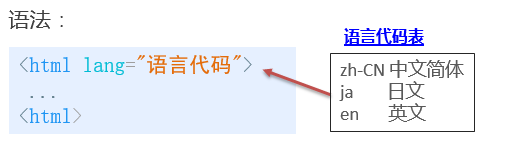

特点：

帮助 搜索引擎 的检索归类 和 浏览器 的翻译功能

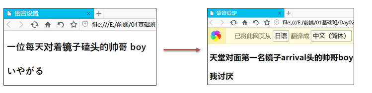

## 字符集

字符集：文字与编码数据的映射关系表 ，保存 和 读取 时使用相同或兼容的字符集，才能正确显示文字

语法：


常见字符集：

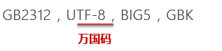

**注意：**

	- 保存和读取时的字符集必须一致，否则会出现 **乱码**
	- 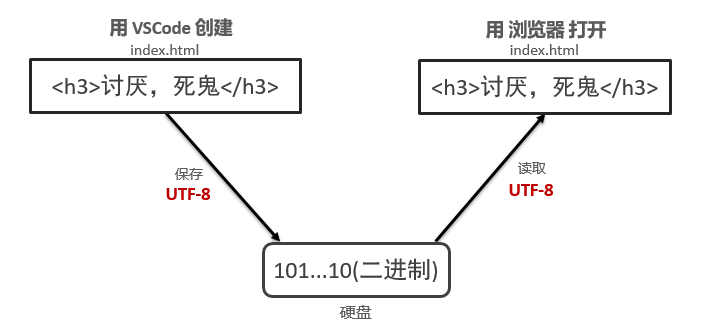

## 表格

**学习路径**

- 表格基本使用
- 表格相关属性
- 表格结构标签
- 表格合并单元格

### 表格基本使用

场景：主要用在需要 **显示、展示数据** 的页面

基本语法：

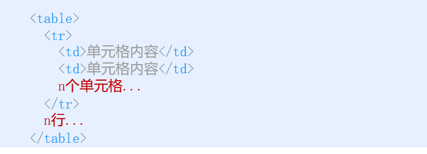

table 标签：定义表格，规定表格的范围

tr 标签：定义表格行，必须包含在 table 标签中

td 标签：定义单元格，必须包含在 tr 标签中

单词：**tr** -> table row , **td** -> table data

注意嵌套关系


#### 表头单元格标签

场景：用在表格第一行，文本内容会加粗居中显示

基本语法：

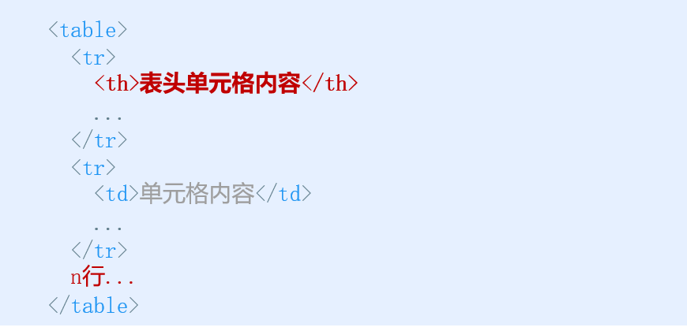

单词：**th** -> table head 缩写

注意：本质上也是单元格，所以也放在 tr 标签中

### 表格相关属性：

场景：设置表格的基本展示效果，但真实开发时主要用 CSS设置

目的：

- 熟悉这些英文单词，以后学CSS中会用到

- 让表格外观先好看一点

属性：

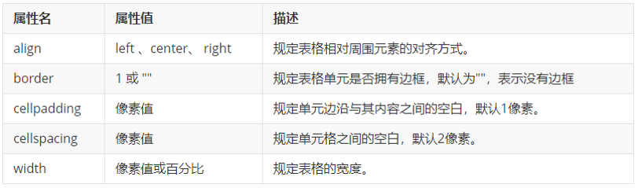

### 表格结构标签：

场景：表格数据多时，把表格内部拆成多个部分，方便浏览器逐一加载显示

基本语法：**表格头** **表格体 表格脚**

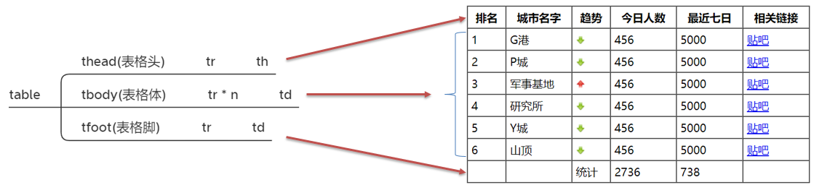

标签解释：

- thead 标签：定义表格头(复杂的表格头可以有多行)

- tbody 标签：定义表格主体，主要用来包含数据(一个表格可以有多个表格主体)

- tfoot 标签：定义表格脚，主要用来包含统计数据(用的少)

**注意：**

- **三个表格结构标签的书写顺序，不会影响到显示的顺序**

- **如果表格中没有写结构标签，浏览器会自动生成** **tbody** **标签**

### 表格合并单元格

场景：将横向或纵向的多个单元格合并成一个单元格

语法：在单元格标签上 写 合并属性

- 跨行合并（纵向合并）：rowspan = "要合并的单元格个数"

- 跨列合并（横向合并）：colspan = "要合并的单元格个数"

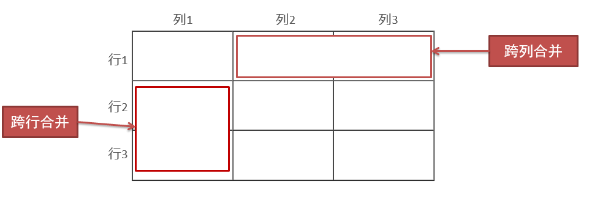

**目标单元格**

概念：目标单元格，是指**合并属性**所在的单元格

- 跨行（纵向）：最上面的第一个单元格 为 目标单元格，添加 rowspan属性

- 跨列（横向）：最左边的第一个单元格 为 目标单元格，添加 colspan属性

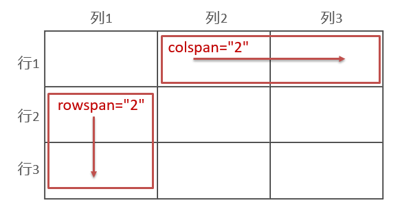

**合并单元格三部曲：**

1. 先确定是跨行还是跨列合并
2. 确定目标单元格，写上合并属性，如：```<td colspan="2"> </td>```
3. 删除多余的单元格

### 表格小结

表格学习整体可以分为三大部分:

**表格的相关标签**

​	table   thead  body  tr  th  td 

**表格的相关属性**

​	cellspacing    cellpadding     width  height  border 

**合并单元格**

​	  rowspan   collspan

## 表单

**学习路径**

- 表单介绍和表单域
- 表单控件 - input
- 表单控件 - select
- 表单控件 - textarea

场景：需要收集信息时，可以使用表单
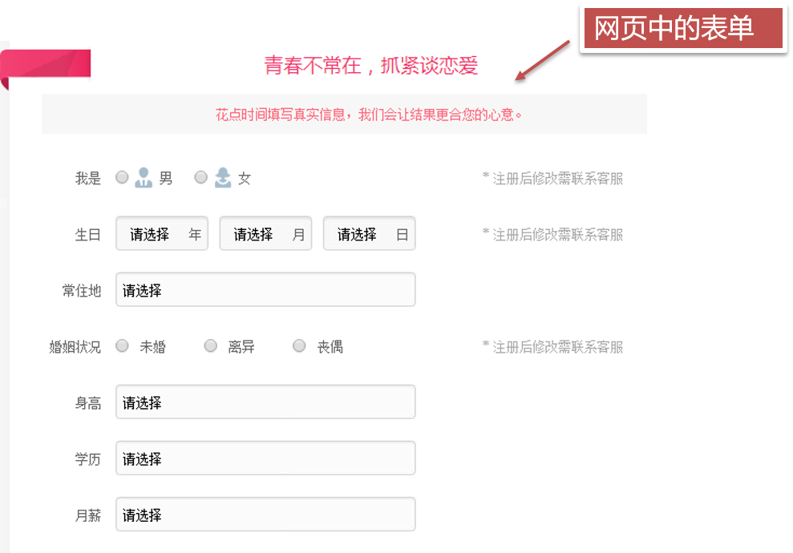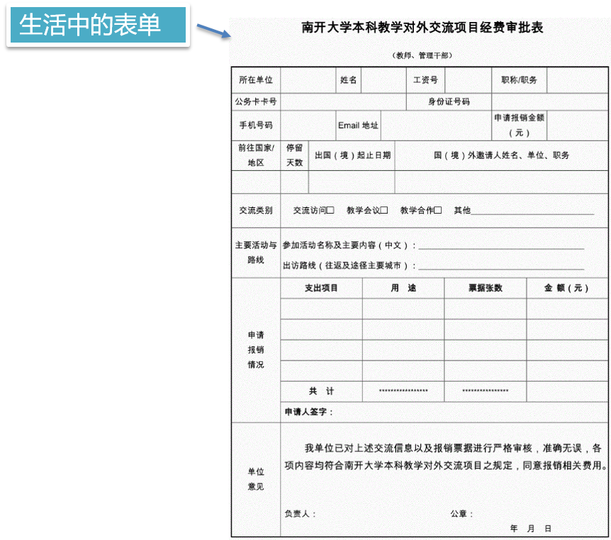

HTML中，完整的表单由三部分组成：**表单域、表单控件(表单元素)、提示信息**

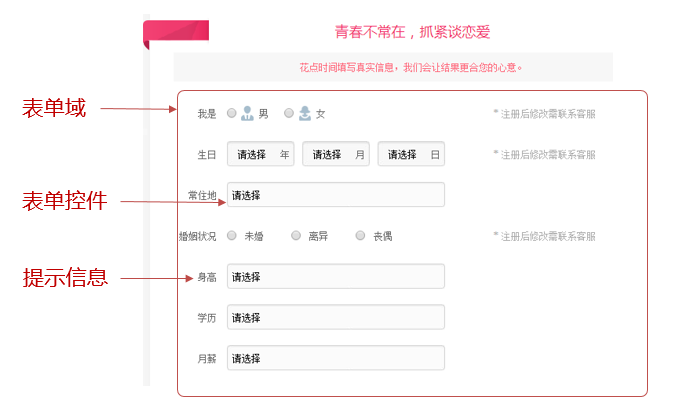

概念：

- 表单域：包含表单元素的区域

- 表单控件：接收用户输入信息的控件

- 提示信息：提示用户输入内容

### 表单域

表单域：是一个包含表单元素的区域（可以看成是一个快递包裹箱子）

作用：可以将表单中包含的数据发送给服务器 (快递包裹寄给女朋友)

语法：

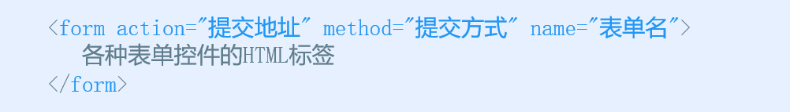

常用属性：

**注意：基础班暂时用不到表单域提交数据，咱们先写上 form标签，就业班会讲解表单传递数据**

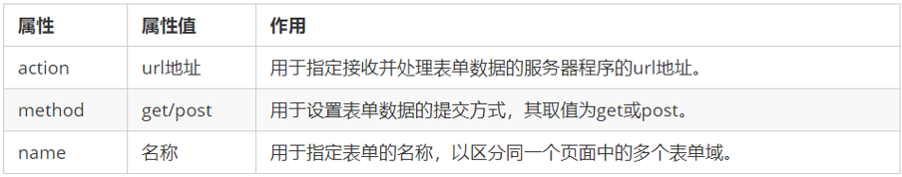

### 表单控件 - input：

​    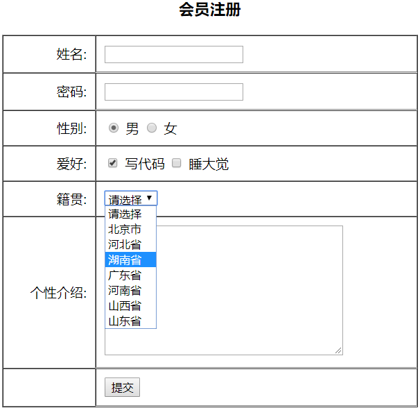

场景：用于收集用户信息的控件标签，有很多种类型

语法：


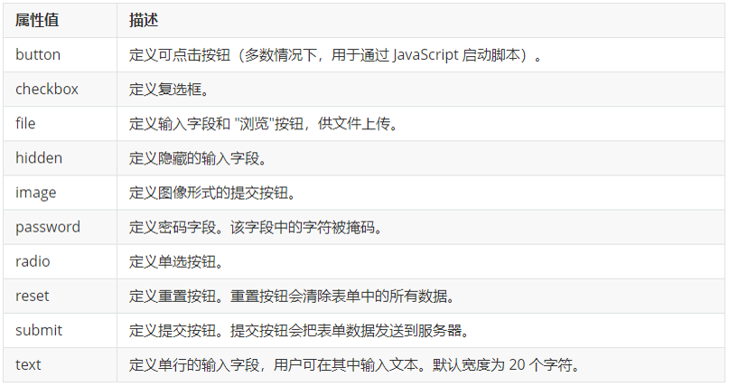

除 type 属性外，`<input>`标签还有其他很多属性，其常用属性如下：

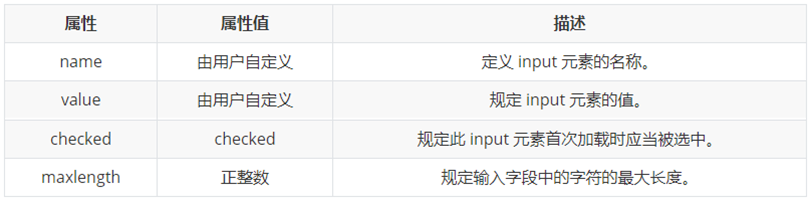

特点：

- name 和 value 是每个表单控件标签都有的属性

- name 可以用来 为 单选按钮 和 复选按钮 **分组**

#### 补充内容

属性： 

1. id -> HTML标签的 唯一标识 ( 同一个页面上标签的 id 不要重复 ) 

2. placeholder -> 可以为 **输入框** 设置 提示文字

语法：

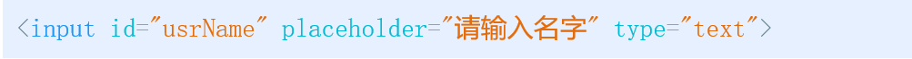

特点：

- id 和 name 不同，页面中标签的id不要重复，而name可以重复(单选按钮分组)

- placeholder 的提示文字，会自动显示或隐藏

**label标签:**

**标签**：label 标签，可以让 **单选和多选按钮** 更容易点击

语法:


特点：点击 lable 中的文本，相当于 点击了 id 值 与 for 值一样的 输入框

### **表单控件** - select

场景：可以提供多个选择项给用户选择，节约页面空间

语法：

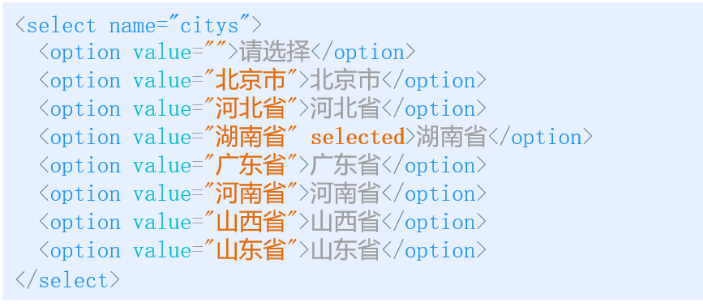

注意：

- **select** **标签** 至少 包含 一对 **option** **标签**

- option标签 可以通过 添加 selected 属性 设置为 默认选项

### 表单控件 - textarea

 场景：可以输入多行文本的"文本框"

语法：

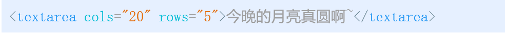

注意：

- cols="每行的字符数" ，rows="显示的行数"
- 文本域 默认文本值 不用 value，而是将 默认值 放到 标签中间
- 也可以使用 placeholder 设置提示	

## 查阅文档：

​    经常查阅文档是一个非常好的学习习惯。
​    推荐的网址： 
​    百度:  http://www.baidu.com 注意使用关键词
​    W3C :  http://www.w3school.com.cn/
​    MDN: https://developer.mozilla.org/zh-CN/

**切记：文档只是工具，动手写案例才是最高效的学习方式**

